# Configure RTX v5 {#config_rtx5}

The file **RTX_Config.h** defines the configuration parameters of CMSIS-RTOS RTX and must be part of every project that is using the CMSIS-RTOS2 RTX kernel. The configuration options are explained in detail in the following sections:

- \ref systemConfig covers system-wide settings for the global memory pool, tick frequency, ISR event buffer and round-robin thread switching as well as process isolation-related features.
- \ref threadConfig provides several parameters to configure the \ref CMSIS_RTOS_ThreadMgmt functions.
- \ref timerConfig provides several parameters to configure the \ref CMSIS_RTOS_TimerMgmt functions.
- \ref eventFlagsConfig provides several parameters to configure the \ref CMSIS_RTOS_EventFlags functions.
- \ref mutexConfig provides several parameters to configure the \ref CMSIS_RTOS_MutexMgmt functions.
- \ref semaphoreConfig provides several parameters to configure the \ref CMSIS_RTOS_SemaphoreMgmt functions.
- \ref memPoolConfig provides several parameters to configure the \ref CMSIS_RTOS_PoolMgmt functions.
- \ref msgQueueConfig provides several parameters to configure the \ref CMSIS_RTOS_Message functions.
- \ref evtrecConfig provides several parameters to configure RTX for usage with [Event Recorder](https://arm-software.github.io/CMSIS-View/latest/evr.html).

The file `RTX_Config.c` contains default implementations of the functions \ref osRtxIdleThread and \ref osRtxErrorNotify. Both functions can simply be overwritten with a customized behavior by redefining them as part of the user code.

The configuration file uses **Configuration Wizard Annotations**. Refer to **Pack - Configuration Wizard Annotations** for details.

Depending on the development tool, the annotations might lead to a more user-friendly graphical representation of the settings. The picture below shows the **Configuration Wizard** view in µVision MDK:

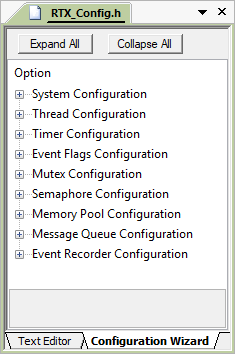

Alternatively one can provide configuration options using the compiler command line.

For example one can customize the used tick frequency to 100us by (overwriting) the configuration using

```
cc -DOS_TICK_FREQ=100
```

## System Configuration {#systemConfig}

The system configuration covers system-wide settings for the global memory pool, tick frequency, ISR event buffer and
round-robin thread switching.

**System Configuration Options**

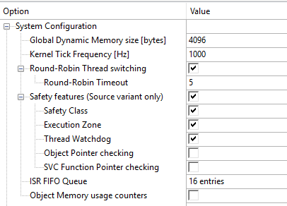

Name                               | \#define                 | Description
-----------------------------------|--------------------------|----------------------------------------------------------------
\ref systemConfig_glob_mem         | `OS_DYNAMIC_MEM_SIZE`    | Defines the combined global dynamic memory size for the \ref GlobalMemoryPool. Default value is \token{32768}. Value range is \token{[0-1073741824]} bytes, in multiples of \token{8} bytes.
Kernel Tick Frequency (Hz)         | `OS_TICK_FREQ`           | Defines base time unit for delays and timeouts in Hz. Default value is \token{1000} (1000 Hz = 1 ms period).
\ref systemConfig_rr               | `OS_ROBIN_ENABLE`        | Enables Round-Robin Thread switching. Default value is \token{1} (enabled).
Round-Robin Timeout                | `OS_ROBIN_TIMEOUT`       | Defines how long a thread will execute before a thread switch. Default value is \token{5}. Value range is \token{[1-1000]}.
\ref safetyConfig_safety           | `OS_SAFETY_FEATURES`     | Enables safety-related features as configured in this group. Default value is \token{1} (enabled).
Safety class                       | `OS_SAFETY_CLASS`        | Enables \ref rtos_process_isolation_safety_class functionality. Default value is \token{1} (enabled).
MPU Protected Zone                 | `OS_EXECUTION_ZONE`      | Enables \ref rtos_process_isolation_mpu. Default value is \token{1} (enabled).
Thread Watchdog                    | `OS_THREAD_WATCHDOG`     | Enables \ref rtos_process_isolation_thread_wdt functionality. Default value is \token{1} (enabled).
Object Pointer checking            | `OS_OBJ_PTR_CHECK`       | Enables verification of object pointer alignment and memory region. Default value is \token{0} (disabled).
SVC Function Pointer checking      | `OS_SVC_PTR_CHECK`       | Enables verification of SVC function pointer alignment and memory region. Default value is \token{0} (disabled).
\ref systemConfig_isr_fifo         | `OS_ISR_FIFO_QUEUE`      | RTOS Functions called from ISR store requests to this buffer. Default value is \token{16 entries}. Value range is \token{[4-256]} entries in multiples of \token{4}.
\ref systemConfig_usage_counters   | `OS_OBJ_MEM_USAGE`       | Enables object memory usage counters to evaluate the maximum memory pool requirements individually for each RTOS object type. Default value is \token{0} (disabled).

### Global Dynamic Memory size [bytes] {#systemConfig_glob_mem}

Refer to \ref GlobalMemoryPool.

### Round-Robin Thread Switching {#systemConfig_rr}

RTX5 may be configured to use round-robin multitasking thread switching. Round-robin allows quasi-parallel execution of several threads of the \a same priority. Threads are not really executed concurrently, but are scheduled where the available CPU time is divided into time slices and RTX5 assigns a time slice to each thread. Because the time slice is typically short (only a few milliseconds), it appears as though threads execute simultaneously.

Round-robin thread switching functions as follows:

- the tick is preloaded with the timeout value when a thread switch occurs
- the tick is decremented (if not already zero) each system tick if the same thread is still executing
- when the tick reaches 0 it indicates that a timeout has occurred. If there is another thread ready with the *same* priority, then the system switches to that thread and the tick is preloaded with timeout again.

In other words, threads execute for the duration of their time slice (unless a thread's time slice is given up). Then, RTX switches to the next thread that is in **READY** state and has the same priority. If no other thread with the same priority is ready to run, the current running thread resumes it execution.

Round-Robin multitasking is controlled with the `#define OS_ROBIN_ENABLE`. The time slice period is configured (in RTX timer ticks) with the `#define OS_ROBIN_TIMEOUT`.

### Safety features (Source variant only) {#safetyConfig_safety}

Safety features group in \ref systemConfig enables individual selection of safety-related functionalities. It requires that RTX is used in the source variant.

It also includes:

- Thread functions: \ref osThreadProtectPrivileged

**MPU Protected Zone**<br/>
Enables \ref rtos_process_isolation_mpu functionality in the system. This includes:

- Thread attributes: \ref osThreadZone
- Thread functions: \ref osThreadGetZone, \ref osThreadTerminateZone
- Zone Management: \ref osZoneSetup_Callback

When enabled, the MPU Protected Zone values also need to be specified for the threads created by the kernel:

- For Idle thread in \ref threadConfig
- For Timer thread in \ref timerConfig

**Safety class**<br/>
Enables \ref rtos_process_isolation_safety_class functionality in the system RTOS. This includes:

- Object attributes: \ref osSafetyClass
- Kernel functions: \ref osKernelProtect, \ref osKernelDestroyClass
- Thread functions: \ref osThreadGetClass, \ref osThreadSuspendClass, \ref osThreadResumeClass

When enabled, the safety class values need to be specified for threads created  by the kernel:

- For Idle thread in \ref threadConfig
- For Timer thread in \ref timerConfig

**Thread Watchdog**<br/>
Enables \ref rtos_process_isolation_thread_wdt functionality in the system RTOS. This includes:

- Thread functions: \ref osThreadFeedWatchdog
- Handler functions: \ref osWatchdogAlarm_Handler

**Object Pointer checking**<br/>
Enables verification of object pointer alignment and memory region.

Before accessing RTX objects the RTX kernel verifies that obtained object pointer is valid (at least not \token{NULL}). When *Object Pointer checking* is enabled the kernel will additionally verify that the control block of the object is located in the memory section allocated for such object type, and that it is correctly aligned within that memory section.

If static memory allocation is used, the user shall place the control blocks of the objects into the correct named memory sections as described in \ref StaticObjectMemory.

For object-specific and dynamic memory allocations the kernel will place the objects correctly.

**SVC Function Pointer checking**<br/>
Enables verification of SVC function pointer alignment and memory region.

Many kernel functions are executed in SVC context. Corresponding function pointers are placed by the kernel into a special named memory section. If *SVC Function Pointer checking* is enabled the kernel before calling an SVC function will additionally verify that its pointer is located in the expected memory section and is correctly aligned within that memory region.

### ISR FIFO Queue {#systemConfig_isr_fifo}

The RTX functions (\ref CMSIS_RTOS_ISR_Calls), when called from and interrupt handler, store the request type and optional parameter to the ISR FIFO queue buffer to be processed later, after the interrupt handler exits.

The scheduler is activated immediately after the IRQ handler has finished its execution to process the requests stored to the FIFO queue buffer. The required size of this buffer depends on the number of functions that are called within the interrupt handler. An insufficient queue size will be caught by \ref osRtxErrorNotify with error code \ref osRtxErrorISRQueueOverflow.

### Object Memory Usage Counters {#systemConfig_usage_counters}

Object memory usage counters help to evaluate the maximum memory pool requirements for each object type, just like stack watermarking does for threads. The initial setup starts with a global memory pool for all object types. Consecutive runs of the application with object memory usage counters enabled, help to introduce object specific memory pools for each object type. Normally, this is required for applications that require a functional safety certification as global memory pools are not allowed in this case.

## Thread Configuration {#threadConfig}

The RTX5 provides several parameters to configure the \ref CMSIS_RTOS_ThreadMgmt functions.

**Thread Configuration Options**

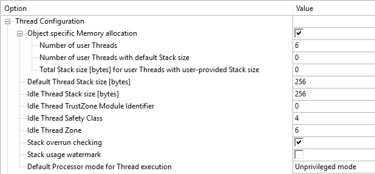

Option                                          | \#define               | Description
:--------------------------------------------------------------------------|:-------------------------------|:---------------------------------------------------------------
Object specific Memory allocation               | `OS_THREAD_OBJ_MEM`   | Enables object specific memory allocation. See \ref ObjectMemoryPool.
Number of user Threads                          | `OS_THREAD_NUM`       | Defines maximum number of user threads that can be active at the same time. Applies to user threads with system provided memory for control blocks. Default value is \token{1}. Value range is \token{[1-1000]}.
Number of user Threads with default Stack size  | `OS_THREAD_DEF_STACK_NUM`     | Defines maximum number of user threads with default stack size and applies to user threads with \token{0} stack size specified. Value range is \token{[0-1000]}.
Total Stack size [bytes] for user Threads with user-provided Stack size    | `OS_THREAD_USER_STACK_SIZE` | Defines the combined stack size for user threads with user-provided stack size. Default value is \token{0}. Value range is \token{[0-1073741824]} Bytes, in multiples of \token{8}.
Default Thread Stack size [bytes]               | `OS_STACK_SIZE`    | Defines stack size for threads with zero stack size specified. Default value is \token{3072}. Value range is \token{[96-1073741824]} Bytes, in multiples of \token{8}.
Idle Thread Stack size [bytes]                  | `OS_IDLE_THREAD_STACK_SIZE`  | Defines stack size for Idle thread. Default value is \token{512}. Value range is \token{[72-1073741824]} bytes, in multiples of \token{8}.
Idle Thread TrustZone Module ID                 | `OS_IDLE_THREAD_TZ_MOD_ID`   | Defines the \ref osThreadAttr_t::tz_module "TrustZone Module ID" the Idle Thread shall use. This needs to be set to a non-zero value if the Idle Thread need to call secure functions. Default value is \token{0}.
Idle Thread Safety Class                        | `OS_IDLE_THREAD_CLASS`       | Defines the the \ref rtos_process_isolation_safety_class "Safety Class" for the Idle thread. Applied only if Safety Class functionality is enabled in \ref systemConfig. Default value is \token{0}.
Idle Thread Zone                                | `OS_IDLE_THREAD_ZONE`        | Defines the \ref rtos_process_isolation_mpu "MPU Protected Zone" for the Idle thread. Applied only if MPU protected Zone functionality is enabled in \ref systemConfig. Default value is \token{0}.
Stack overrun checking                          | `OS_STACK_CHECK`             | Enable stack overrun checks at thread switch.
Stack usage watermark                           | `OS_STACK_WATERMARK`         | Initialize thread stack with watermark pattern for analyzing stack usage. Enabling this option increases significantly the execution time of thread creation.
Processor mode for Thread execution             | `OS_PRIVILEGE_MODE`          | Controls the default processor mode when not specified through thread attributes \ref osThreadUnprivileged or \ref osThreadPrivileged. Default value is \token{Unprivileged} mode. Value range is \token{[0=Unprivileged; 1=Privileged]} mode.

### Configuration of Thread Count and Stack Space {#threadConfig_countstack}

The RTX5 kernel uses a separate stack space for each thread and provides two methods for defining the stack requirements:

- **Static allocation**: when \ref osThreadAttr_t::stack_mem and \ref osThreadAttr_t::stack_size specify a memory area
  which is used for the thread stack. **Attention**: The stack memory provided must be 64-bit aligned, i.e. by using uint64_t for declaration.
- **Dynamic allocation**: when \ref osThreadAttr_t is NULL or \ref osThreadAttr_t::stack_mem is NULL, the system
  allocates the stack memory from:
  - Object-specific Memory Pool (default Stack size) when "Object specific Memory allocation" is enabled and "Number of
    user Threads with default Stack size" is not \token{0} and \ref osThreadAttr_t::stack_size is \token{0} (or
    \ref osThreadAttr_t is NULL).
  - Object-specific Memory Pool (user-provided Stack size) when "Object specific Memory allocation" is enabled and "Total
    Stack size for user..."  is not \token{0} and \ref osThreadAttr_t::stack_size is not \token{0}.
  - Global Memory Pool when "Object specific Memory allocation" is disabled or (\ref osThreadAttr_t::stack_size is not
    \token{0} and "Total Stack size for user..." is \token{0}) or (\ref osThreadAttr_t::stack_size is \token{0} and
    "Number of user Threads with default Stack size" is \token{0}).

\ref osThreadAttr_t is a parameter of the function \ref osThreadNew.

> **Note**
>
> - Before the RTX kernel is started by the \ref osKernelStart() function, the main stack defined in startup_<i>device</i>.s is used.
>   The main stack is also used for:
>   - user application calls to RTX functions in **thread mode** using SVC calls
>   - interrupt/exception handlers.

\subsection threadConfig_ovfcheck Stack Overflow Checking

RTX5 implements a software stack overflow checking that traps stack overruns. Stack is used for return addresses and automatic variables. Extensive usage or incorrect stack configuration may cause a stack overflow. Software stack overflow checking is controlled with the define `OS_STACK_CHECK`.

If a stack overflow is detected, the function \ref osRtxErrorNotify with error code \ref osRtxErrorStackOverflow is called. By default, this function is implemented as an endless loop and will practically stop code execution.

\subsection threadConfig_watermark Stack Usage Watermark

RTX5 initializes thread stack with a watermark pattern (0xCC) when a thread is created. This allows the debugger to determine the maximum stack usage for each thread. It is typically used during development but removed from the final application. Stack usage watermark is controlled with the define `OS_STACK_WATERMARK`.

Enabling this option significantly increases the execution time of \ref osThreadNew (depends on thread stack size).

\subsection threadConfig_procmode Processor Mode for Thread Execution

RTX5 allows to execute threads in unprivileged or privileged processor mode. The processor mode is configured for all threads with the define `OS_PRIVILEGE_MODE`.

It is also possible to specify the privilege level for individual threads. For that use \ref osThreadUnprivileged and \ref osThreadPrivileged defines in the *attr_bits* of \ref osThreadAttr_t argument when creating a thread with \ref osThreadNew.

In **unprivileged** processor mode, the application software:

- has limited access to the MSR and MRS instructions, and cannot use the CPS instruction.
- cannot access the system timer, NVIC, or system control block.
- might have restricted access to memory or peripherals.

In **privileged** processor mode, the application software can use all the instructions and has access to all resources.

\section timerConfig Timer Configuration

RTX5 provides several parameters to configure the \ref CMSIS_RTOS_TimerMgmt functions.

**Timer Configuration Options**

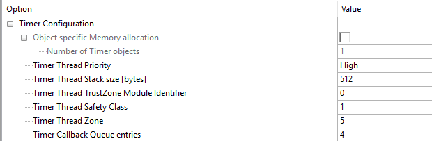

Name                                   | \#define                 | Description
---------------------------------------|--------------------------------|----------------------------------------------------------------
Object specific Memory allocation      | `OS_TIMER_OBJ_MEM`      | Enables object specific memory allocation.
Number of Timer objects                | `OS_TIMER_NUM`          | Defines maximum number of objects that can be active at the same time. Applies to objects with system provided memory for control blocks. Value range is \token{[1-1000]}.
Timer Thread Priority                  | `OS_TIMER_THREAD_PRIO`        | Defines priority for timer thread. Default value is \token{40}. Value range is \token{[8-48]}, in multiples of \token{8}. The numbers have the following priority correlation: \token{8=Low}; \token{16=Below Normal}; \token{24=Normal}; \token{32=Above Normal}; \token{40=High}; \token{48=Realtime}
Timer Thread Stack size [bytes]        | `OS_TIMER_THREAD_STACK_SIZE`  | Defines stack size for Timer thread. May be set to 0 when timers are not used. Default value is \token{512}. Value range is \token{[0-1073741824]}, in multiples of \token{8}.
Timer Thread TrustZone Module ID       | `OS_TIMER_THREAD_TZ_MOD_ID`   | Defines the \ref osThreadAttr_t::tz_module "TrustZone Module ID" the Timer Thread shall use. This needs to be set to a non-zero value if any Timer Callbacks need to call secure functions. Default value is \token{0}.
Timer Thread Safety Class              | `OS_TIMER_THREAD_CLASS`        | Defines the the \ref rtos_process_isolation_safety_class "Safety Class" for the Timer thread. Applied only if Safety class functionality is enabled in \ref systemConfig. Default value is \token{0}.
Timer Thread Zone                      | `OS_TIMER_THREAD_ZONE`         | Defines the \ref rtos_process_isolation_mpu "MPU Protected Zone" for the Timer thread. Applied only if MPU protected Zone functionality is enabled in \ref systemConfig. Default value is \token{0}.
Timer Callback Queue entries           | `OS_TIMER_CB_QUEUE`           | Number of concurrent active timer callback functions. May be set to 0 when timers are not used. Default value is \token{4}. Value range is \token{[0-256]}.

\subsection timerConfig_obj Object-specific memory allocation

See \ref ObjectMemoryPool.

\subsection timerConfig_user User Timer Thread

The RTX5 function **osRtxTimerThread** executes callback functions when a time period expires. The priority of the timer subsystem within the complete RTOS system is inherited from the priority of the **osRtxTimerThread**. This is configured by `OS_TIMER_THREAD_PRIO`. Stack for callback functions is supplied by **osRtxTimerThread**. `OS_TIMER_THREAD_STACK_SIZE` must satisfy the stack requirements of the callback function with the highest stack usage.

\section eventFlagsConfig Event Flags Configuration

RTX5 provides several parameters to configure the \ref CMSIS_RTOS_EventFlags functions.

**Event Configuration Options**

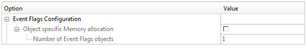

Name                                   | \#define                 | Description
---------------------------------------|--------------------------|----------------------------------------------------------------
Object specific Memory allocation      | `OS_EVFLAGS_OBJ_MEM`    | Enables object specific memory allocation. See \ref ObjectMemoryPool.
Number of Event Flags objects          | `OS_EVFLAGS_NUM`        | Defines maximum number of objects that can be active at the same time. Applies to objects with system provided memory for control blocks. Value range is \token{[1-1000]}.

\subsection eventFlagsConfig_obj Object-specific memory allocation

When object-specific memory is used, the pool size for all Event objects is specified by `OS_EVFLAGS_NUM`. Refer to \ref ObjectMemoryPool.

\section mutexConfig Mutex Configuration

RTX5 provides several parameters to configure the \ref CMSIS_RTOS_MutexMgmt functions.

**Mutex Configuration Options**

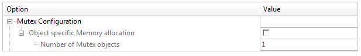

Name                                   | \#define                 | Description
---------------------------------------|--------------------------|----------------------------------------------------------------
Object specific Memory allocation      | `OS_MUTEX_OBJ_MEM`      | Enables object specific memory allocation. See \ref ObjectMemoryPool.
Number of Mutex objects                | `OS_MUTEX_NUM`          | Defines maximum number of objects that can be active at the same time. Applies to objects with system provided memory for control blocks. Value range is \token{[1-1000]}.

\subsection mutexConfig_obj Object-specific Memory Allocation

When object-specific memory is used, the pool size for all Mutex objects is specified by `OS_MUTEX_NUM`. Refer to \ref ObjectMemoryPool.

\section semaphoreConfig Semaphore Configuration

RTX5 provides several parameters to configure the \ref CMSIS_RTOS_SemaphoreMgmt functions.

**Semaphore Configuration Options**

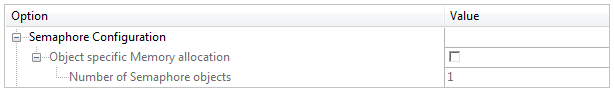

Name                                   | \#define                 | Description
---------------------------------------|--------------------------|----------------------------------------------------------------
Object specific Memory allocation      | `OS_SEMAPHORE_OBJ_MEM`  | Enables object specific memory allocation. See \ref ObjectMemoryPool.
Number of Semaphore objects            | `OS_SEMAPHORE_NUM`      | Defines maximum number of objects that can be active at the same time. Applies to objects with system provided memory for control blocks. Value range is \token{[1-1000]}.

\subsection semaphoreConfig_obj Object-specific memory allocation

When Object-specific Memory is used, the pool size for all Semaphore objects is specified by `OS_SEMAPHORE_NUM`. Refer to \ref ObjectMemoryPool.

\section memPoolConfig Memory Pool Configuration

RTX5 provides several parameters to configure the \ref CMSIS_RTOS_PoolMgmt functions.

**Memory Pool Configuration Options**

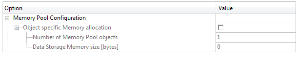

Name                                   | \#define                 | Description
---------------------------------------|--------------------------|----------------------------------------------------------------
Object specific Memory allocation      | `OS_MEMPOOL_OBJ_MEM`    | Enables object specific memory allocation. See \ref ObjectMemoryPool.
Number of Memory Pool objects          | `OS_MEMPOOL_NUM`        | Defines maximum number of objects that can be active at the same time. Applies to objects with system provided memory for control blocks. Value range is \token{[1-1000]}.
Data Storage Memory size [bytes]       | `OS_MEMPOOL_DATA_SIZE`  | Defines the combined data storage memory size. Applies to objects with system provided memory for data storage. Default value is \token{0}. Value range is \token{[0-1073741824]}, in multiples of \token{8}.

\subsection memPoolConfig_obj Object-specific memory allocation

When object-specific memory is used, the number of pools for all MemoryPool objects is specified by `OS_MEMPOOL_NUM`. The total storage size reserved for all pools is configured in `OS_MEMPOOL_DATA_SIZE`. Refer to \ref ObjectMemoryPool.

\section msgQueueConfig Message Queue Configuration

RTX5 provides several parameters to configure the \ref CMSIS_RTOS_Message functions.

**MessageQueue Configuration Options**

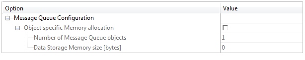

Name                                   | \#define                 | Description
---------------------------------------|--------------------------|----------------------------------------------------------------
Object specific Memory allocation      | `OS_MSGQUEUE_OBJ_MEM`   | Enables object specific memory allocation. See \ref ObjectMemoryPool.
Number of Message Queue objects        | `OS_MSGQUEUE_NUM`       | Defines maximum number of objects that can be active at the same time. Applies to objects with system provided memory for control blocks. Value range is \token{[1-1000]}.
Data Storage Memory size [bytes]       | `OS_MSGQUEUE_DATA_SIZE` | Defines the combined data storage memory size. Applies to objects with system provided memory for data storage. Default value is \token{0}. Value range is \token{[0-1073741824]}, in multiples of \token{8}.

\subsection msgQueueConfig_obj Object-specific memory allocation

When Object-specific Memory is used, the number of queues for all Message Queue objects is specified by `OS_MSGQUEUE_NUM`. The total storage size reserved for all queues is configured in `OS_MSGQUEUE_DATA_SIZE`. Refer to \ref ObjectMemoryPool.

\section evtrecConfig Event Recorder Configuration

This section describes the configuration settings for the [Event Recorder](https://arm-software.github.io/CMSIS-View/latest/evr.html) annotations. The usage requires the source variant of RTX5; refer to \ref cre_rtx_proj_er for more information.

\subsection evtrecConfigGlobIni Global Configuration

Initialize Event Recorder during the \ref osKernelInitialize and optionally start event recording.

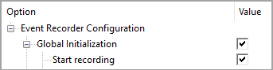

Name                  | \#define        | Description
----------------------|-----------------|----------------------------------------------------------------
Global Initialization | `OS_EVR_INIT`  | Initialize Event Recorder during \ref osKernelInitialize.
Start Recording       | `OS_EVR_START` | Start event recording after initialization.

> **Note**
>
> - If **Global Initialization** (`OS_EVR_INIT`) is set, an explicit call to `EventRecorderInitialize` is not required.
> - If **Start Recording** (`OS_EVR_START`) is set, an explicit call to `EventRecorderStart` is not required. You may call the function `EventRecorderStop` to stop recording.

**Global Event Filter Setup**

These event filter settings are applied to all software component numbers, including MDK middleware and user components.

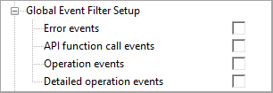

Name                      | \#define         | Description
--------------------------|------------------|----------------------------------------------------------------
Error events              | `OS_EVR_LEVEL`  | Enable error events.
API function call events  | `OS_EVR_LEVEL`  | Enable API function call events.
Operation events          | `OS_EVR_LEVEL`  | Enable operation events.
Detailed operation events | `OS_EVR_LEVEL`  | Enable detailed operation events.

> **Note**
>
> - You may disable event recording for specific software components by calling the function `EventRecorderDisable`.

**RTOS Event Filter Setup**

These event filter settings are applied to specific RTX component groups with sub-options for:

- Error events
- API function call events
- Operation events
- Detailed operation events

The generation of events must be enabled as explained under \ref evtrecConfigEvtGen.

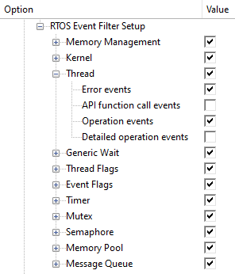

Name              | \#define                   | Description
------------------|----------------------------|----------------------------------------------------------------
Memory Management | `OS_EVR_MEMORY_LEVEL`     | Recording level for Memory Management events.
Kernel            | `OS_EVR_KERNEL_LEVEL`     | Recording level for Kernel events.
Thread            | `OS_EVR_THREAD_LEVEL`     | Recording level for Thread events.
Generic Wait      | `OS_EVR_WAIT_LEVEL`       | Recording level for Generic Wait events.
Thread Flags      | `OS_EVR_THFLAGS_LEVEL`    | Recording level for Thread Flags events.
Event Flags       | `OS_EVR_EVFLAGS_LEVEL`    | Recording level for Event Flags events.
Timer             | `OS_EVR_TIMER_LEVEL`      | Recording level for Timer events.
Mutex             | `OS_EVR_MUTEX_LEVEL`      | Recording level for Mutex events.
Semaphore         | `OS_EVR_SEMAPHORE_LEVEL`  | Recording level for Semaphore events.
Memory Pool       | `OS_EVR_MEMPOOL_LEVEL`    | Recording level for Memory Pool events.
Message Queue     | `OS_EVR_MSGQUEUE_LEVEL`   | Recording level for Message Queue events.

\subsection evtrecConfigEvtGen RTOS Event Generation

Enable the event generation for specific RTX component groups. This requires the RTX source variant (refer to \ref cre_rtx_proj_er for more information).

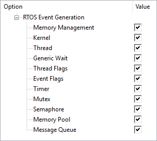

Name              | \#define                 | Description
------------------|--------------------------|----------------------------------------------------------------
Memory Management | `OS_EVR_MEMORY`         | Enables Memory Management events generation.
Kernel            | `OS_EVR_KERNEL`         | Enables Kernel events generation.
Thread            | `OS_EVR_THREAD`         | Enables Thread events generation.
Generic Wait      | `OS_EVR_WAIT`           | Enables Generic Wait events generation.
Thread Flags      | `OS_EVR_THFLAGS`        | Enables Thread Flags events generation.
Event Flags       | `OS_EVR_EVFLAGS`        | Enables Event Flags events generation.
Timer             | `OS_EVR_TIMER`          | Enables Timer events generation.
Mutex             | `OS_EVR_MUTEX`          | Enables Mutex events generation.
Semaphore         | `OS_EVR_SEMAPHORE`      | Enables Semaphore events generation.
Memory Pool       | `OS_EVR_MEMPOOL`        | Enables Memory Pool events generation.
Message Queue     | `OS_EVR_MSGQUEUE`       | Enables Message Queue events generation.

> **Note**
>
> - If event generation for a component is disabled, the code that generates the related events is not included. Thus, \ref evtrecConfigGlobIni "filters" for this component will have no effect and the debugger is unable to display any events for the related component group.

\subsection systemConfig_event_recording Manual event configuration

To disable the generation of events for a specific RTX API call, use the following \#define settings (from **rtx_evr.h**) and add these manually to the **RTX_Config.h** file:

**Memory events:**

`EVR_RTX_MEMORY_INIT_DISABLE`, `EVR_RTX_MEMORY_ALLOC_DISABLE`, `EVR_RTX_MEMORY_FREE_DISABLE`,
`EVR_RTX_MEMORY_BLOCK_INIT_DISABLE`, `EVR_RTX_MEMORY_BLOCK_ALLOC_DISABLE`, `EVR_RTX_MEMORY_BLOCK_FREE_DISABLE`

**Kernel events:**

`EVR_RTX_KERNEL_ERROR_DISABLE`, `EVR_RTX_KERNEL_INITIALIZE_DISABLE`, `EVR_RTX_KERNEL_INITIALIZED_DISABLE`,
`EVR_RTX_KERNEL_GET_INFO_DISABLE`, `EVR_RTX_KERNEL_INFO_RETRIEVED_DISABLE`, `EVR_RTX_KERNEL_GET_STATE_DISABLE`,
`EVR_RTX_KERNEL_START_DISABLE`, `EVR_RTX_KERNEL_STARTED_DISABLE`, `EVR_RTX_KERNEL_LOCK_DISABLE`,
`EVR_RTX_KERNEL_LOCKED_DISABLE`, `EVR_RTX_KERNEL_UNLOCK_DISABLE`, `EVR_RTX_KERNEL_UNLOCKED_DISABLE`,
`EVR_RTX_KERNEL_RESTORE_LOCK_DISABLE`, `EVR_RTX_KERNEL_LOCK_RESTORED_DISABLE`, `EVR_RTX_KERNEL_SUSPEND_DISABLE`,
`EVR_RTX_KERNEL_SUSPENDED_DISABLE`, `EVR_RTX_KERNEL_RESUME_DISABLE`, `EVR_RTX_KERNEL_RESUMED_DISABLE`,
`EVR_RTX_KERNEL_PROTECT_DISABLE`, `EVR_RTX_KERNEL_PROTECTED_DISABLE`,
`EVR_RTX_KERNEL_GET_TICK_COUNT_DISABLE`, `EVR_RTX_KERNEL_GET_TICK_FREQ_DISABLE`,
`EVR_RTX_KERNEL_GET_SYS_TIMER_COUNT_DISABLE`, `EVR_RTX_KERNEL_GET_SYS_TIMER_FREQ_DISABLE`,
`EVR_RTX_KERNEL_DESTROY_CLASS_DISABLE`, `EVR_RTX_KERNEL_ERROR_NOTIFY_DISABLE`

**Thread events:**

`EVR_RTX_THREAD_ERROR_DISABLE`, `EVR_RTX_THREAD_NEW_DISABLE`, `EVR_RTX_THREAD_CREATED_DISABLE`,
`EVR_RTX_THREAD_GET_NAME_DISABLE`, `EVR_RTX_THREAD_GET_ID_DISABLE`, `EVR_RTX_THREAD_GET_STATE_DISABLE`,
`EVR_RTX_THREAD_GET_CLASS_DISABLE`, `EVR_RTX_THREAD_GET_ZONE_DISABLE`,
`EVR_RTX_THREAD_GET_STACK_SIZE_DISABLE`, `EVR_RTX_THREAD_GET_STACK_SPACE_DISABLE`, `EVR_RTX_THREAD_SET_PRIORITY_DISABLE`,
`EVR_RTX_THREAD_PRIORITY_UPDATED_DISABLE`, `EVR_RTX_THREAD_GET_PRIORITY_DISABLE`, `EVR_RTX_THREAD_YIELD_DISABLE`,
`EVR_RTX_THREAD_SUSPEND_DISABLE`, `EVR_RTX_THREAD_SUSPENDED_DISABLE`, `EVR_RTX_THREAD_RESUME_DISABLE`,
`EVR_RTX_THREAD_RESUMED_DISABLE`, `EVR_RTX_THREAD_DETACH_DISABLE`, `EVR_RTX_THREAD_DETACHED_DISABLE`,
`EVR_RTX_THREAD_JOIN_DISABLE`, `EVR_RTX_THREAD_JOIN_PENDING_DISABLE`, `EVR_RTX_THREAD_JOINED_DISABLE`,
`EVR_RTX_THREAD_BLOCKED_DISABLE`, `EVR_RTX_THREAD_UNBLOCKED_DISABLE`, `EVR_RTX_THREAD_PREEMPTED_DISABLE`,
`EVR_RTX_THREAD_SWITCHED_DISABLE`, `EVR_RTX_THREAD_EXIT_DISABLE`, `EVR_RTX_THREAD_TERMINATE_DISABLE`,
`EVR_RTX_THREAD_DESTROYED_DISABLE`, `EVR_RTX_THREAD_GET_COUNT_DISABLE`, `EVR_RTX_THREAD_ENUMERATE_DISABLE`,
`EVR_RTX_THREAD_FEED_WATCHDOG_DISABLE`, `EVR_RTX_THREAD_FEED_WATCHDOG_DONE_DISABLE`, `EVR_RTX_THREAD_WATCHDOG_EXPIRED_DISABLE`,
`EVR_RTX_THREAD_PROTECT_PRIVILEGED_DISABLE`, `EVR_RTX_THREAD_PRIVILEGED_PROTECTED_DISABLE`,
`EVR_RTX_THREAD_SUSPEND_CLASS_DISABLE`, `EVR_RTX_THREAD_RESUME_CLASS_DISABLE`, `EVR_RTX_THREAD_TERMINATE_ZONE_DISABLE`

**Generic wait events:**

`EVR_RTX_DELAY_ERROR_DISABLE`, `EVR_RTX_DELAY_DISABLE`, `EVR_RTX_DELAY_UNTIL_DISABLE`,
`EVR_RTX_DELAY_STARTED_DISABLE`, `EVR_RTX_DELAY_UNTIL_STARTED_DISABLE`, `EVR_RTX_DELAY_COMPLETED_DISABLE`

**Thread flag events:**

`EVR_RTX_THREAD_FLAGS_ERROR_DISABLE`, `EVR_RTX_THREAD_FLAGS_SET_DISABLE`, `EVR_RTX_THREAD_FLAGS_SET_DONE_DISABLE`,
`EVR_RTX_THREAD_FLAGS_CLEAR_DISABLE`, `EVR_RTX_THREAD_FLAGS_CLEAR_DONE_DISABLE`, `EVR_RTX_THREAD_FLAGS_GET_DISABLE`,
`EVR_RTX_THREAD_FLAGS_WAIT_DISABLE`, `EVR_RTX_THREAD_FLAGS_WAIT_PENDING_DISABLE`, `EVR_RTX_THREAD_FLAGS_WAIT_TIMEOUT_DISABLE`,
`EVR_RTX_THREAD_FLAGS_WAIT_COMPLETED_DISABLE`, `EVR_RTX_THREAD_FLAGS_WAIT_NOT_COMPLETED_DISABLE`

**Event flag events:**

`EVR_RTX_EVENT_FLAGS_ERROR_DISABLE`, `EVR_RTX_EVENT_FLAGS_NEW_DISABLE`, `EVR_RTX_EVENT_FLAGS_CREATED_DISABLE`,
`EVR_RTX_EVENT_FLAGS_GET_NAME_DISABLE,` `EVR_RTX_EVENT_FLAGS_SET_DISABLE`, `EVR_RTX_EVENT_FLAGS_SET_DONE_DISABLE`,
`EVR_RTX_EVENT_FLAGS_CLEAR_DISABLE`, `EVR_RTX_EVENT_FLAGS_CLEAR_DONE_DISABLE`, `EVR_RTX_EVENT_FLAGS_GET_DISABLE`,
`EVR_RTX_EVENT_FLAGS_WAIT_DISABLE`, `EVR_RTX_EVENT_FLAGS_WAIT_PENDING_DISABLE`,
`EVR_RTX_EVENT_FLAGS_WAIT_TIMEOUT_DISABLE`, `EVR_RTX_EVENT_FLAGS_WAIT_COMPLETED_DISABLE`,
`EVR_RTX_EVENT_FLAGS_WAIT_NOT_COMPLETED_DISABLE`, `EVR_RTX_EVENT_FLAGS_DELETE_DISABLE`,
`EVR_RTX_EVENT_FLAGS_DESTROYED_DISABLE`

**Timer events:**

`EVR_RTX_TIMER_ERROR_DISABLE`, `EVR_RTX_TIMER_CALLBACK_DISABLE`, `EVR_RTX_TIMER_NEW_DISABLE`,
`EVR_RTX_TIMER_CREATED_DISABLE`, `EVR_RTX_TIMER_GET_NAME_DISABLE`, `EVR_RTX_TIMER_START_DISABLE`,
`EVR_RTX_TIMER_STARTED_DISABLE`, `EVR_RTX_TIMER_STOP_DISABLE`, `EVR_RTX_TIMER_STOPPED_DISABLE`,
`EVR_RTX_TIMER_IS_RUNNING_DISABLE`, `EVR_RTX_TIMER_DELETE_DISABLE`, `EVR_RTX_TIMER_DESTROYED_DISABLE`

**Mutex events:**

`EVR_RTX_MUTEX_ERROR_DISABLE`, `EVR_RTX_MUTEX_NEW_DISABLE`, `EVR_RTX_MUTEX_CREATED_DISABLE`,
`EVR_RTX_MUTEX_GET_NAME_DISABLE`, `EVR_RTX_MUTEX_ACQUIRE_DISABLE`, `EVR_RTX_MUTEX_ACQUIRE_PENDING_DISABLE`,
`EVR_RTX_MUTEX_ACQUIRE_TIMEOUT_DISABLE`, `EVR_RTX_MUTEX_ACQUIRED_DISABLE`, `EVR_RTX_MUTEX_NOT_ACQUIRED_DISABLE`,
`EVR_RTX_MUTEX_RELEASE_DISABLE`, `EVR_RTX_MUTEX_RELEASED_DISABLE`, `EVR_RTX_MUTEX_GET_OWNER_DISABLE`,
`EVR_RTX_MUTEX_DELETE_DISABLE`, `EVR_RTX_MUTEX_DESTROYED_DISABLE`

**Semaphore events:**

`EVR_RTX_SEMAPHORE_ERROR_DISABLE`, `EVR_RTX_SEMAPHORE_NEW_DISABLE`, `EVR_RTX_SEMAPHORE_CREATED_DISABLE`,
`EVR_RTX_SEMAPHORE_GET_NAME_DISABLE`, `EVR_RTX_SEMAPHORE_ACQUIRE_DISABLE`, `EVR_RTX_SEMAPHORE_ACQUIRE_PENDING_DISABLE`,
`EVR_RTX_SEMAPHORE_ACQUIRE_TIMEOUT_DISABLE`, `EVR_RTX_SEMAPHORE_ACQUIRED_DISABLE`,
`EVR_RTX_SEMAPHORE_NOT_ACQUIRED_DISABLE`, `EVR_RTX_SEMAPHORE_RELEASE_DISABLE`, `EVR_RTX_SEMAPHORE_RELEASED_DISABLE`,
`EVR_RTX_SEMAPHORE_GET_COUNT_DISABLE`, `EVR_RTX_SEMAPHORE_DELETE_DISABLE`, `EVR_RTX_SEMAPHORE_DESTROYED_DISABLE`

**Memory pool events:**

`EVR_RTX_MEMORY_POOL_ERROR_DISABLE`, `EVR_RTX_MEMORY_POOL_NEW_DISABLE`, `EVR_RTX_MEMORY_POOL_CREATED_DISABLE`,
`EVR_RTX_MEMORY_POOL_GET_NAME_DISABLE`, `EVR_RTX_MEMORY_POOL_ALLOC_DISABLE`, `EVR_RTX_MEMORY_POOL_ALLOC_PENDING_DISABLE`,
`EVR_RTX_MEMORY_POOL_ALLOC_TIMEOUT_DISABLE`, `EVR_RTX_MEMORY_POOL_ALLOCATED_DISABLE`,
`EVR_RTX_MEMORY_POOL_ALLOC_FAILED_DISABLE`, `EVR_RTX_MEMORY_POOL_FREE_DISABLE`, `EVR_RTX_MEMORY_POOL_DEALLOCATED_DISABLE`,
`EVR_RTX_MEMORY_POOL_FREE_FAILED_DISABLE`, `EVR_RTX_MEMORY_POOL_GET_CAPACITY_DISABLE`,
`EVR_RTX_MEMORY_POOL_GET_BLOCK_SZIE_DISABLE`, `EVR_RTX_MEMORY_POOL_GET_COUNT_DISABLE`,
`EVR_RTX_MEMORY_POOL_GET_SPACE_DISABLE`, `EVR_RTX_MEMORY_POOL_DELETE_DISABLE`, `EVR_RTX_MEMORY_POOL_DESTROYED_DISABLE`

**Message queue events:**

`EVR_RTX_MESSAGE_QUEUE_ERROR_DISABLE`, `EVR_RTX_MESSAGE_QUEUE_NEW_DISABLE`, `EVR_RTX_MESSAGE_QUEUE_CREATED_DISABLE`,
`EVR_RTX_MESSAGE_QUEUE_GET_NAME_DISABLE`, `EVR_RTX_MESSAGE_QUEUE_PUT_DISABLE`,
`EVR_RTX_MESSAGE_QUEUE_PUT_PENDING_DISABLE`, `EVR_RTX_MESSAGE_QUEUE_PUT_TIMEOUT_DISABLE`,
`EVR_RTX_MESSAGE_QUEUE_INSERT_PENDING_DISABLE`, `EVR_RTX_MESSAGE_QUEUE_INSERTED_DISABLE`,
`EVR_RTX_MESSAGE_QUEUE_NOT_INSERTED_DISABLE`, `EVR_RTX_MESSAGE_QUEUE_GET_DISABLE`,
`EVR_RTX_MESSAGE_QUEUE_GET_PENDING_DISABLE`, `EVR_RTX_MESSAGE_QUEUE_GET_TIMEOUT_DISABLE`,
`EVR_RTX_MESSAGE_QUEUE_RETRIEVED_DISABLE`, `EVR_RTX_MESSAGE_QUEUE_NOT_RETRIEVED_DISABLE`,
`EVR_RTX_MESSAGE_QUEUE_GET_CAPACITY_DISABLE`, `EVR_RTX_MESSAGE_QUEUE_GET_MSG_SIZE_DISABLE`,
`EVR_RTX_MESSAGE_QUEUE_GET_COUNT_DISABLE`, `EVR_RTX_MESSAGE_QUEUE_GET_SPACE_DISABLE`,
`EVR_RTX_MESSAGE_QUEUE_RESET_DISABLE`, `EVR_RTX_MESSAGE_QUEUE_RESET_DONE_DISABLE`,
`EVR_RTX_MESSAGE_QUEUE_DELETE_DISABLE`, `EVR_RTX_MESSAGE_QUEUE_DESTROYED_DISABLE`
