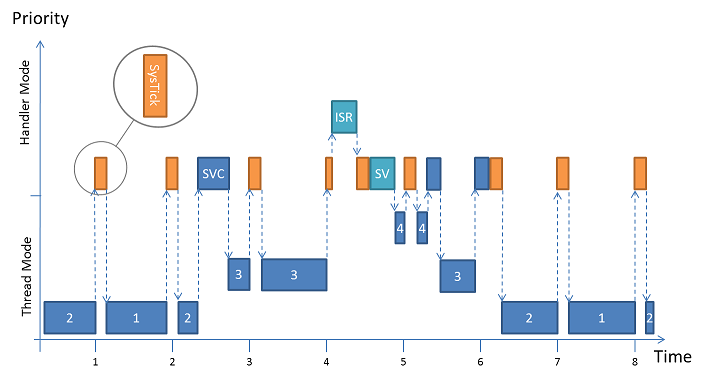
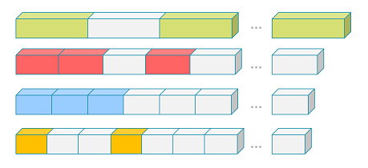
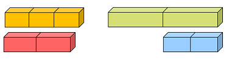

# Theory of Operation {#theory_of_operation}

Many aspects of the kernel are configurable and the configuration options are mentioned where applicable.

## Scheduler {#rtx_scheduler}

RTX5 implements a low-latency preemptive scheduler. Major parts of RTX5 are executed in handler mode such as

- `SysTick_Handler` used for time-based scheduling.
- `SVC_Handler` used for lock-based scheduling.
- `PendSV_Handler` used for interrupt-based scheduling.

In order to be low-latency with respect to ISR execution those system exceptions are configured to use the lowest priority groups available. The priorities are configured such that no preemption happens between them. Thus no interrupt critical sections (i.e. interrupt locks) are needed to protect the scheduler.



The scheduler combines priority and round-robin based context switches. The example depicted in the image above contains four threads (1, 2, 3, and 4). Threads 1 and 2 share the same priority, thread 3 has a higher one and thread 4 the highest (\ref osThreadAttr_t::priority). As long as threads 3 and 4 are blocked the scheduler switches between thread 1 and 2 on a time-slice basis (round-robin). The time-slice for round-robin scheduling can be configured, see Round-Robin Timeout in \ref systemConfig.

Thread 2 unblocks thread 3 by an arbitrary RTOS-call (executed in \ref CMSIS_RTOS_svcFunctions "SVC" handler mode) at time index 2. The scheduler switches to thread 3 immediately because thread 3 has the highest priority. Thread 4 is still blocked.

At time index 4 an interrupt (ISR) occurs and preempts the `SysTick_Handler`. RTX does not add any latency to the interrupt service execution. The ISR routine uses an RTOS-call that unblocks thread 4. Instead of switching to thread 4 immediately the PendSV flag is set to defer the context switching. The `PendSV_Handler` is executed right after the `SysTick_Handler` returns and the deferred context switch to thread 4 is carried out. As soon as highest priority thread 4 blocks again by using a blocking RTOS-call execution is switched back to thread 3 immediately during time index 5.

At time index 5 thread 3 uses a blocking RTOS-call as well. Thus the scheduler switches back to thread 2 for time index 6.

At time index 7 the scheduler uses the round-robin mechanism to switch to thread 1 and so on.

## Kernel Start {#rtx_SystemStartup}

The start of the kernel need to be performed

## Memory Allocation {#rtx_MemoryAllocation}

RTX5 objects (thread, mutex, semaphore, timer, message queue, thread and event flags, as well as memory pool) require dedicated RAM memory. Objects can be created using os<i>Object</i>New() calls and deleted using os<i>Object</i>Delete() calls. The related object memory needs to be available during the lifetime of the object.

RTX5 offers three different memory allocation methods for objects:

- \ref GlobalMemoryPool uses a single global memory pool for all objects. It is easy to configure, but may have the disadvantage for memory fragmentation when objects with different sizes are created and destroyed.
- \ref ObjectMemoryPool uses a fixed-size memory pool for each object type. The method is time deterministic and avoids memory fragmentation.
- \ref StaticObjectMemory reserves memory during compile time and completely avoids that a system can be out of memory. This is typically a required for some safety critical systems.

It's possible to intermix all the memory allocation methods in the same application.

### Global Memory Pool {#GlobalMemoryPool}

The global memory pool allocates all objects from a memory area. This method of memory allocation is the default configuration setting of RTX5.


When the memory pool does not provide sufficient memory, the creation of the object fails and the related os<i>Object</i>New() function returns \token{NULL}.

Enabled in \ref systemConfig.

### Object-specific Memory Pools {#ObjectMemoryPool}

Object-specific memory pools avoids memory fragmentation with a dedicated fixed-size memory management for each object type.

This type of memory pools are fully time deterministic, which means that object creation and destruction takes always the same fixed amount of time. As a fixed-size memory pool is specific to an object type, the handling of out-of-memory situations is simplified.



Object-specific memory pools are selectively enabled for each object type, e.g: mutex or thread using the RTX configuration
file:

- Enabled in \ref threadConfig for thread objects.
- Enabled in \ref timerConfig for timer objects.
- Enabled in \ref eventFlagsConfig for event objects.
- Enabled in \ref mutexConfig for mutex objects.
- Enabled in \ref semaphoreConfig for semaphore.
- Enabled in \ref memPoolConfig for memory pools.
- Enabled in \ref msgQueueConfig for message objects.

When the memory pool does not provide sufficient memory, the creation of the object fails and the related os<i>Object</i>New() function returns \token{NULL}.

### Static Object Memory {#StaticObjectMemory}

In contrast to the dynamic memory allocations, the static memory allocation requires compile-time allocation of object memory.



Static memory allocation can be achieved by providing user-defined memory using attributes at object creation, see \ref CMSIS_RTOS_MemoryMgmt_Manual. Please take special note of the following restrictions:

Memory type                                  | Requirements
---------------------------------------------|-------------------------------------------------------------------------------
Control Block (osXxxAttr_t::cb_mem)          | 4-Byte alignment. Size defined by \ref osRtxThreadCbSize, \ref osRtxTimerCbSize, \ref osRtxEventFlagsCbSize, \ref osRtxMutexCbSize, \ref osRtxSemaphoreCbSize, \ref osRtxMemoryPoolCbSize, \ref osRtxMessageQueueCbSize.
Thread Stack (osThreadAttr_t::stack_mem)     | 8-Byte alignment. Size is application specific, i.e. amount of stack variables and frames.
Memory Pool (osMemoryPoolAttr_t::mp_mem)     | 4-Byte alignment. Size calculated with \ref osRtxMemoryPoolMemSize.
Message Queue (osMessageQueueAttr_t::mq_mem) | 4-Byte alignment. Size calculated with \ref osRtxMessageQueueMemSize.

In order to allow RTX5 aware debugging, i.e. Component Viewer, to recognize control blocks, they need to be placed in individual memory sections by using `__attribute__((section(...)))`.

RTX Object    | Linker Section
--------------|------------------------
Thread        | `.bss.os.thread.cb`
Timer         | `.bss.os.timer.cb`
Event Flags   | `.bss.os.evflags.cb`
Mutex         | `.bss.os.mutex.cb`
Semaphore     | `.bss.os.semaphore.cb`
Memory Pool   | `.bss.os.mempool.cb`
Message Queue | `.bss.os.msgqueue.cb`

It must be assured that these sections are placed into contiguous memory. This can fail, i.e. sections end up being split over multiple memory segments, when assigning compilation units to memory segments, manually.

The following code example shows how to create an OS object using static memory.

**Code Example:**

```c
/*----------------------------------------------------------------------------
 * CMSIS-RTOS 'main' function template
 *---------------------------------------------------------------------------*/

#include "RTE_Components.h"
#include  CMSIS_device_header
#include "cmsis_os2.h"
 
//include rtx_os.h for types of RTX objects
#include "rtx_os.h"
 
//The thread function instanced in this example
void worker(void *arg)
{
  while(1) 
  {
    //work
    osDelay(10000);
  }  
}
 
// Define objects that are statically allocated for worker thread 1
__attribute__((section(".bss.os.thread.cb")))
osRtxThread_t worker_thread_tcb_1;
 
// Reserve two areas for the stacks of worker thread 1
// uint64_t makes sure the memory alignment is 8
uint64_t worker_thread_stk_1[64];
 
// Define the attributes which are used for thread creation
// Optional const saves RAM memory and includes the values in periodic ROM tests 
const osThreadAttr_t worker_attr_1 = {
  "wrk1",
  osThreadJoinable,
  &worker_thread_tcb_1,
  sizeof(worker_thread_tcb_1),
  &worker_thread_stk_1[0],
  sizeof(worker_thread_stk_1),
  osPriorityAboveNormal,
  0
};
 
// Define ID object for thread
osThreadId_t th1;
 
/*----------------------------------------------------------------------------
 * Application main thread
 *---------------------------------------------------------------------------*/
void app_main (void *argument) {
  uint32_t param = NULL;
 
  // Create an instance of the worker thread with static resources (TCB and stack)
  th1 = osThreadNew(worker, &param, &worker_attr_1);
 
  for (;;) {}
}
 
int main (void) {
  // System Initialization
  SystemCoreClockUpdate();
  // ...

  osKernelInitialize();                 // Initialize CMSIS-RTOS
  osThreadNew(app_main, NULL, NULL);    // Create application main thread
  osKernelStart();                      // Start thread execution
  for (;;) {}
}
```

## Thread Stack Management {#ThreadStack}

For Cortex-M processors without floating point unit the thread context requires 64 bytes on the local stack.

> **Note**
>
> - For Cortex-M4/M7 with FP the thread context requires 200 bytes on the local stack. For these devices the default stack space should be increased to a minimum of 300 bytes.

Each thread is provided with a separate stack that holds the thread context and stack space for automatic variables and return addresses for function call nesting. The stack sizes of RTX threads are flexibly configurable as explained in the section \ref threadConfig. RTX offers a configurable checking for stack overflows and stack utilization.

## Low-Power Operation {#lowPower}

The system thread `osRtxIdleThread` can be use to switch the system into a low-power mode. The easiest form to enter a low-power mode is the execution of the `__WFE` function that puts the processor into a sleep mode where it waits for an event.

**Code Example:**

```c
#include "RTE_Components.h"
#include CMSIS_device_header            /* Device definitions                 */
 
void osRtxIdleThread (void) {
  /* The idle demon is a system thread, running when no other thread is       */
  /* ready to run.                                                            */
 
  for (;;) {
    __WFE();                            /* Enter sleep mode                   */
  }
}
```

> **Note**
>
> - `__WFE()` is not available in every Cortex-M implementation. Check device manuals for availability.

## RTX Kernel Timer Tick {#kernelTimer}

RTX uses the generic \ref CMSIS_RTOS_TickAPI to configure and control its periodic Kernel Tick.

To use an alternative timer as the Kernel Tick Timer one simply needs to implement a custom version of the \ref CMSIS_RTOS_TickAPI.

> **Note**
>
> - The OS Tick implementation provided must assure that the used timer interrupt uses the same (low) priority group as the service interrupts, i.e. interrupts used by RTX must not preempt each other. Refer to the \ref rtx_scheduler section for more details.

### Tick-less Low-Power Operation {#TickLess}

RTX5 provides extension for tick-less operation which is useful for applications that use extensively low-power modes where the SysTick timer is also disabled. To provide a time-tick in such power-saving modes, a wake-up timer is used to derive timer intervals. The CMSIS-RTOS2 functions \ref osKernelSuspend and \ref osKernelResume control the tick-less operation.

Using this functions allows the RTX5 thread scheduler to stop the periodic kernel tick interrupt. When all active threads are suspended, the system enters power-down and calculates how long it can stay in this power-down mode. In the power-down mode the processor and peripherals can be switched off. Only a wake-up timer must remain powered, because this timer is responsible to wake-up the system after the power-down period expires.

The tick-less operation is controlled from the `osRtxIdleThread` thread. The wake-up timeout value is set before the system enters the power-down mode. The function \ref osKernelSuspend calculates the wake-up timeout measured in RTX Timer Ticks; this value is used to setup the wake-up timer that runs during the power-down mode of the system.

Once the system resumes operation (either by a wake-up time out or other interrupts) the RTX5 thread scheduler is started with the function \ref osKernelResume. The parameter \a sleep_time specifies the time (in RTX Timer Ticks) that the system was in power-down mode.

**Code Example:**

```c
#include "msp.h"                        // Device header

/*----------------------------------------------------------------------------
 *      MSP432 Low-Power Extension Functions
 *---------------------------------------------------------------------------*/
static void MSP432_LP_Entry(void) {
  /* Enable PCM rude mode, which allows to device to enter LPM3 without waiting for peripherals */
  PCM->CTL1 = PCM_CTL1_KEY_VAL | PCM_CTL1_FORCE_LPM_ENTRY;       
  /* Enable all SRAM bank retentions prior to going to LPM3  */
  SYSCTL->SRAM_BANKRET |= SYSCTL_SRAM_BANKRET_BNK7_RET;
  __enable_interrupt();
  NVIC_EnableIRQ(RTC_C_IRQn);
  /* Do not wake up on exit from ISR */
  SCB->SCR |= SCB_SCR_SLEEPONEXIT_Msk;
  /* Setting the sleep deep bit */
  SCB->SCR |= (SCB_SCR_SLEEPDEEP_Msk);
}
 
static volatile unsigned int tc;
static volatile unsigned int tc_wakeup;
 
void RTC_C_IRQHandler(void)
{
  if (tc++ > tc_wakeup)
  {
    SCB->SCR &= ~SCB_SCR_SLEEPONEXIT_Msk;
    NVIC_DisableIRQ(RTC_C_IRQn);
    NVIC_ClearPendingIRQ(RTC_C_IRQn);
    return;
  }
  if (RTC_C->PS0CTL & RTC_C_PS0CTL_RT0PSIFG)
  {
    RTC_C->CTL0 = RTC_C_KEY_VAL;                 // Unlock RTC key protected registers
    RTC_C->PS0CTL &= ~RTC_C_PS0CTL_RT0PSIFG;
    RTC_C->CTL0 = 0;
    SCB->SCR |= (SCB_SCR_SLEEPDEEP_Msk);
  }
}
 
uint32_t g_enable_sleep = 0;
  
void osRtxIdleThread (void) {
  
  for (;;) {
    tc_wakeup = osKernelSuspend();
    /* Is there some time to sleep? */
    if (tc_wakeup > 0) {
      tc = 0;
      /* Enter the low power state */
      MSP432_LP_Entry();
      __WFE();
    }
    /* Adjust the kernel ticks with the amount of ticks slept */
    osKernelResume (tc);
  }
}
```

> **Note**
>
> - `__WFE()` is not available in every Arm Cortex-M implementation. Check device manuals for availability.

The alternative using `__WFI()` has other issues, explained in the Arm Knowledge Based Article [Low Power RTX Applications on Cortex-M Devices](https://developer.arm.com/documentation/ka002948/latest).

## Timeout Value {#CMSIS_RTOS_TimeOutValue}

Timeout values are an argument to several `osXxx` functions to allow time for resolving a request. A timeout value of  **0** means that the RTOS does not wait and the function returns instantly, even when no resource is available. A timeout value of \ref osWaitForever means that the RTOS waits infinitely until a resource becomes available. Or one forces the thread to resume using \ref osThreadResume which is discouraged.

The timeout value specifies the number of timer ticks until the time delay elapses. The value is an upper bound and depends on the actual time elapsed since the last timer tick.

Examples:

- timeout value **0** : the system does not wait, even when no resource is available the RTOS function returns instantly.
- timeout value **1** : the system waits until the next timer tick occurs; depending on the previous timer tick, it may be a very short wait time.
- timeout value **2** : actual wait time is between 1 and 2 timer ticks.
- timeout value \ref osWaitForever : system waits infinite until a resource becomes available.


## Using Interrupts on Cortex-M {#cre_UsingIRQs}

On Cortex-M processors, the RTX5 kernel uses the following interrupt exceptions.  The table below also lists the priorities that must be assigned to these interrupts.

Handler | Priority | Interrupt/Exception
:-------|:---------|:----------------------------
SysTick | lowest   | Kernel system timer interrupt to generate periodic timer ticks
PendSV  | lowest   | PendSV (request for system-level service) when calling certain RTX functions from **Handler mode**
SVC     | lowest+1 | Supervisor Call used to enter the RTOS kernel from **Thread mode**

Other device interrupts can be used without limitation. For Arm Cortex-M3/M4/M7 \if ARMv8M /M23/M33/M35P/M55/M85 \endif  processors, interrupts are never disabled by RTX Kernel.

**Usage of interrupt priority grouping**

- The interrupt priority grouping should be configured using the CMSIS-Core function \ref NVIC_SetPriorityGrouping before calling the function \ref osKernelStart(). The RTX kernel uses the priority group value to setup the priority for SysTick and PendSV interrupts.
- The RTX kernel sets the priority for the interrupts/exceptions listed in above table and uses the lowest two priority levels.
- Do not change the priority used by the RTX kernel. If this cannot be avoided, ensure that the preempt priority of SysTick/PendSV is lower than SVC.
- Permitted priority group values are 0 to 6. The priority group value 7 will cause RTX to fail as there is only one priority level available.
- The **main stack** is used to run the RTX functionality. It is therefore required to configure sufficient stack for the RTX kernel execution.

**Code Example**

```c
osKernelInitialize();                            // initialize RTX
NVIC_SetPriorityGrouping (3);                    // setup priority grouping
tread_id = osThreadNew(tread_func, NULL, NULL);  // create some threads
osKernelStart ();                                // start RTX kernel
```

## Calls from Interrupt Service Routines {#CMSIS_RTOS_ISR_Calls}

The following CMSIS-RTOS2 functions can be called from threads and Interrupt Service Routines (ISR):

- \ref osKernelGetInfo, \ref osKernelGetState, \ref osKernelGetTickCount, \ref osKernelGetTickFreq, \ref osKernelGetSysTimerCount, \ref osKernelGetSysTimerFreq
- \ref osThreadGetName, \ref osThreadGetId, \ref osThreadFlagsSet
- \ref osTimerGetName
- \ref osEventFlagsGetName, \ref osEventFlagsSet, \ref osEventFlagsClear, \ref osEventFlagsGet, \ref osEventFlagsWait
- \ref osMutexGetName
- \ref osSemaphoreGetName, \ref osSemaphoreAcquire, \ref osSemaphoreRelease, \ref osSemaphoreGetCount
- \ref osMemoryPoolGetName, \ref osMemoryPoolAlloc, \ref osMemoryPoolFree, \ref osMemoryPoolGetCapacity, \ref osMemoryPoolGetBlockSize, \ref osMemoryPoolGetCount, \ref osMemoryPoolGetSpace
- \ref osMessageQueueGetName, \ref osMessageQueuePut, \ref osMessageQueueGet, \ref osMessageQueueGetCapacity, \ref osMessageQueueGetMsgSize, \ref osMessageQueueGetCount, \ref osMessageQueueGetSpace

Functions that cannot be called from an ISR are verifying the interrupt status and return the status code \ref osErrorISR, in case they are called from an ISR context. In some implementations, this condition might be caught using the HARD_FAULT vector.

> **Note**
>
> - RTX does not disable interrupts during critical sections for Armv7-M and Armv8-M architecture based devices, but rather uses atomic operations.
> - Therefore, there is no need to configure interrupt priorities of interrupt service routines that use RTOS functions.

## SVC Functions {#CMSIS_RTOS_svcFunctions}

Supervisor Calls (SVC) are exceptions targeted at software and operating systems for generating system function calls. They are sometimes called software interrupts. For example, instead of allowing user programs to directly access hardware, an operating system may provide access to hardware through an SVC. So when a user program wants to use certain hardware, it generates the exception using SVC instructions. The software exception handler in the operating system executes and provides the requested service to the user application. In this way, access to hardware is under the control of the OS, which can provide a more robust system by preventing the user applications from directly accessing the hardware.

SVCs can also make software more portable because the user application does not need to know the programming details of the underlying hardware. The user program will only need to know the application programming interface (API) function ID and parameters; the actual hardware-level programming is handled by device drivers.

SVCs run in **privileged handler** mode of the Arm Cortex-M core. SVC functions accept arguments and can return values. The functions are used in the same way as other functions; however, they are executed indirectly through the SVC instruction. When executing SVC instructions, the controller changes to the privileged handler mode.

Interrupts are **not disabled** in this mode. To protect SVC functions from interrupts, you need to include the disable/enable intrinsic functions `__disable_irq()` and `__enable_irq()` in your code.

You can use SVC functions to access protected peripherals, for example, to configure NVIC and interrupts. This is required if you run threads in unprivileged (protected) mode and you need to change interrupts from the within the thread.

To implement SVC functions in your Keil RTX5 project, you need to:

 1. Add the SVC User Table file **svc_user.c** to your project folder and include it into your project. This file is available as a user code template.
 2. Write a function implementation. Example:

  ```c
    uint32_t svc_atomic_inc32 (uint32_t *mem) {
      // A protected function to increment a counter. 
      uint32_t val;
        
      __disable_irq();
      val  = *mem;
      (*mem) = val + 1U;
      __enable_irq();
        
      return (val);
    }
  ```

 3. Add the function to the SVC function table in the **svc_user.c** module:

  ```c
    void * const osRtxUserSVC[1+USER_SVC_COUNT] = {
      (void *)USER_SVC_COUNT,
      (void *)svc_atomic_inc32,
    };
  ```

 4. Increment the number of user SVC functions:

  ```c
    #define USER_SVC_COUNT  1       // Number of user SVC functions
  ```

 5. Declare a function wrapper to be called by the user to execute the SVC call.
 **Code Example** (Arm Compiler 6):

  ```c
    __STATIC_FORCEINLINE uint32_t atomic_inc32 (uint32_t *mem) {
      register uint32_t val;
      
      __ASM volatile (
        "svc 1" : "=l" (val) : "l" (mem) : "cc", "memory"
      );
      return (val);
    }
  ```

> **Note**
>
> - The SVC function \token{0} is reserved for the Keil RTX5 kernel.
> - Do not leave gaps when numbering SVC functions. They must occupy a continuous range of numbers starting from 1.
> - SVC functions can still be interrupted.

\ifnot FuSaRTS
## Arm C library multi-threading protection {#cre_rtx_proj_clib_arm}

RTX5 provides an interface to the [Arm C libraries](https://developer.arm.com/documentation/100073) to ensure static data protection in a multi-threaded application.

The Arm C libraries use static data to store errno, floating-point status word for software floating-point operations, a pointer to the base of the heap, and other variables. The Arm C micro-library (i.e. microlib) does not support protection for multi-threaded applications. See the [Differences between microlib and the default C library](https://developer.arm.com/documentation/100073/latest/The-Arm-C-Micro-library/Differences-between-microlib-and-the-default-C-library).

By default, RTX5 uses the Arm C libraries multi-thread protection for:

- all user threads if \ref threadConfig "Object specific Memory allocation" is enabled.
- the number of threads defined by `OS_THREAD_LIBSPACE_NUM` if \ref threadConfig "Object specific Memory allocation" is disabled. The definition `OS_THREAD_LIBSPACE_NUM` defines the number of threads that can safely call Arm C library functions and can be found in `RTX_Config.h` file or can be defined on the global scope.

The default, Arm C libraries use mutex functions to [protect shared resources from concurrent access](https://developer.arm.com/documentation/100073/0621/The-Arm-C-and-C---Libraries/Multithreaded-support-in-Arm-C-libraries/Management-of-locks-in-multithreaded-applications). RTX5 implements these functions and uses resources from the \ref systemConfig "Global Dynamic Memory" to allocate mutex objects.

\endif
