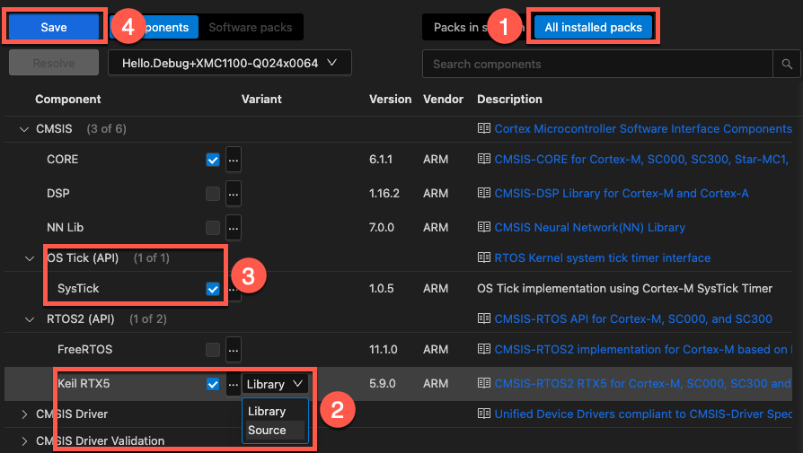

# Create an RTX5 Project {#cre_rtx_proj}

\if FuSaRTS
FuSa RTX5 installation and project setup are explained in \ref fusa_rtx_installation.
\endif

\ifnot FuSaRTS
The steps to create a microcontroller application using RTX5 are:

- \ref inst_pack "Install" the pack.
- In your IDE, create a new project and select a microcontroller device.
- \ref comp-sel "Add the Keil RTX5 software components" to your project.

## Pack installation {#inst_pack}

Add the ARM::CMSIS-RTX pack to your installation:

```
cpackget add ARM::CMSIS-RTX
```

Alternatively, you can download the latest version from the
[CMSIS-RTX](https://www.keil.arm.com/packs/cmsis-rtx-arm/versions/) page.

## Component selection {#comp-sel}

### In the Arm CMSIS Solution extension

In your IDE, open the
[Manage software components](https://mdk-packs.github.io/vscode-cmsis-solution-docs/create_app.html#software-components)
dialog.

1. If you cannot see the **CMSIS:RTOS2 (API):Keil RTX5** component, select to display **All installed packs**.
2. Select the component. Choose to use the **Library** or the **Source** variant.
3. Add the **CMSIS:OS Tick (API):SysTick** component.
4. **Save** the selection.



In the **CMSIS** view, you can add template files to the project:

1. Click on the `+` next to a group.
2. Select **Add From Component Code Template**.
3. Select one of the templates that are shown:


### In uVision

- In the Manage Run-Time Environment window, select **CMSIS\::CORE**, **CMSIS\::OS Tick (API)\::SysTick** and **CMSIS\::RTOS2 (API)\::Keil RTX5**. You can choose to either add RTX as a library (Variant: **Library**) or to add the full source code (Variant: **Source**) - required if using the [Event Recorder](https://arm-software.github.io/CMSIS-View/latest/evr.html):


- If the **Validation Output** requires other components to be present, try to use the **Resolve** button.
- Click **OK**.
- If using the Variant: **Source** as stated above, you have to assure to use at least C99 compiler mode (Project Options -> C/C++ -> C99 Mode).
- You can add template files to the project by right-clicking on **Source Group 1** and selecting **Add New Item to 'Source Group 1'**. In the new window, click on **User Code Template**. On the right-hand side you will see all available template files for CMSIS-RTOS RTX:


- \ref config_rtx5 "Configure" RTX5 to the application's needs using the **%RTX_Config.h** file.

\endif

\if ARMCA
## Additional requirements for RTX on Cortex-A {#cre_rtx_cortexa}

Cortex-A based microcontrollers are less unified with respect to the interrupt and timer implementations used compared to M-class devices. Thus RTX requires additional components when an A-class device is used, namely [CMSIS-Core IRQ Controller (API)](https://arm-software.github.io/CMSIS_6/latest/Core_A/group__irq__ctrl__gr.html) and \ref CMSIS_RTOS_TickAPI "OS Tick (API)" implementations.


The default implementations provided along with CMSIS are

- Arm [Generic Interrupt Controller (GIC)](https://arm-software.github.io/CMSIS_6/latest/Core_A/group__GIC__functions.html)
- Arm Cortex-A5, Cortex-A9 [Private Timer (PTIM)](https://arm-software.github.io/CMSIS_6/latest/Core_A/group__PTM__timer__functions.html)
- Arm Cortex-A7 [Generic Physical Timer (GTIM)](https://arm-software.github.io/CMSIS_6/latest/Core_A/group__PL1__timer__functions.html)

For devices not implementing GIC, PTIM nor GTIM please refer to the according device family pack and select the proper implementations.

\endif

## Add support for RTX specific functions {#cre_rtx_proj_specifics}

If you require some of the \ref rtx5_specific "RTX specific functions" in your application code, \#include the \ref rtx_os_h "header file rtx_os.h". This enables \ref lowPower "low-power" and \ref TickLess "tick-less" operation modes.

## RTX5 Header File {#rtx_os_h}

Every implementation of the CMSIS-RTOS2 API can bring its own additional features. RTX5 adds a couple of \ref rtx5_specific "functions" for the idle more, for error notifications, and special system timer functions. It is also using macros for control block and memory sizes.

If you require some of the RTX specific functions in your application code, include the header file rtx_os.h:

```c
#include "rtx_os.h"
```

## Add Event Recorder Visibility {#cre_rtx_proj_er}

\ifnot FuSaRTS
RTX5 interfaces to the [Event Recorder](https://arm-software.github.io/CMSIS-View/latest/evr.html) to provide event
information which helps you to understand and analyze the operation.

- To use the Event Recorder together with RTX5, select the software component **CMSIS-View:Event Recorder**.
- Select the **Source** variant of the software component **CMSIS:RTOS2 (API):Keil RTX5**.
- Enable the related settings under \ref evtrecConfig.
- Build the application code and download it to the debug hardware.

\endif

Once the target application generates event information, it can be viewed for example with the
[eventlist](https://github.com/ARM-software/CMSIS-View/tree/main/tools/eventlist) tool.

\ifnot FuSaRTS
## Building the RTX5 Library {#creating_RTX5_LIB}

The CMSIS Pack contains a csolution project for building the complete set of RTX5 libraries. This project can also be used as a reference for building the RTX5 libraries using a tool-chain of your choice.

### Build Process

The build process is managed using the following files:

- `RTX_Library.csolution.yml`: Defines the solution configuration.
- `RTX_Library.cproject.yml`: Specifies the project settings.
- `build.sh`: Script that triggers the library build process.

### Libraries Built

The following table lists the files available in the build output directory, its target
architecture with additional attributes and target toolchain.

| Library Name  | Target Architecture (attributes)     | AC6 | GCC | IAR | CLANG
|---------------|--------------------------------------|-----|-----|-----|------
| `RTX_V6M`     | Arm v6-M                             | YES | YES | YES | YES
| `RTX_V7A`     | Arm v7-A                             | YES | YES | YES | NO
| `RTX_V7M`     | Arm v7-M                             | YES | YES | YES | YES
| `RTX_V7MF`    | Arm v7-M (FP)                        | YES | YES | YES | YES
| `RTX_V8MB`    | Arm v8M Base Line                    | YES | YES | YES | YES
| `RTX_V8MBN`   | Arm v8M Base Line (non-secure)       | YES | YES | YES | YES
| `RTX_V8MM`    | Arm v8M Main Line                    | YES | YES | YES | YES
| `RTX_V8MMF`   | Arm v8M Main Line (FP)               | YES | YES | YES | YES
| `RTX_V8MMFN`  | Arm v8M Main Line (FP, non-secure)   | YES | YES | YES | YES
| `RTX_V8MMN`   | Arm v8M Main Line (non-secure)       | YES | YES | YES | YES
| `RTX_V81MM`   | Arm v8.1M Main Line                  | NO  | NO  | YES | NO
| `RTX_V81MMF`  | Arm v8.1M Main Line (FP)             | NO  | NO  | YES | NO
| `RTX_V81MMFN` | Arm v8.1M Main Line (FP, non-secure) | NO  | NO  | YES | NO
| `RTX_V81MMN`  | Arm v8.1M Main Line (non-secure)     | NO  | NO  | YES | NO

- **FP**: library built with Floating Point support
- **non-secure**: library built for TrustZone non-secure domain

All RTX5 libraries are built with debug information produced for use by a debugger.

### Optimization

The build process optimizes RTX5 libraries for size, which translates to the following per compiler
compiler options:

| Compiler | Optimization Option
|----------|--------------------
| AC6      | -Oz
| GCC      | -Os
| IAR      | -Ohz
| CLANG    | -Os

\endif
