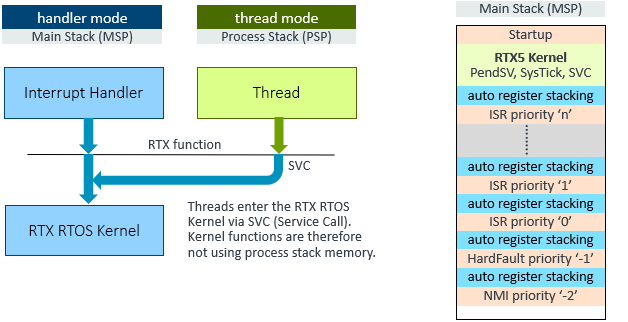

# System Requirements {#rtx_system_reqs}

The following section contains technical information about RTX v5.

- \ref pToolchains lists the compiler toolchains verified to work with RTX v5 kernel.
- \ref tpProcessor lists the hardware requirements of the target processor for running the RTX v5 kernel.
- \ref pStackRequirements lists the memory requirements for the main stack when running the RTX v5 kernel.

## Supported Toolchains {#pToolchains}

\if FuSaRTS
FuSa RTX5 RTOS is validated using the compiler version referenced in <a href="../../Safety/html/index.html#safety_product_overview_toolchain"><b>Tested and Verified Toolchains</b></a> section for the Arm FuSa Run-time System.
\endif

\ifnot FuSaRTS

Keil RTX5 is developed and tested using the common toolchains and development environments.

Current development is verified to work with the following toolchains versions:

- Arm Compiler 6.20
- IAR Embedded Workbench 9.40.2
- GNU Arm Embedded Toolchain 12.3.1
- CLANG (LLVM): 17.0.1

But in most cases, RTX would work well with other versions of these toolchains as well.

\endif

## Processor Requirements {#tpProcessor}

RTX assumes a fully functional processor and uses the following hardware features. It does not implement any confidence test for processor validation which should be provided by an user-supplied software test library.

\if ARMv8M
### Cortex-M0/M0+/M23 device {#tpCortexM0_M0P_M23}
\endif

\ifnot ARMv8M
### Cortex-M0/M0+ device {#tpCortexM0_M0P_M23}
\endif

Hardware Requirement       | Description
:--------------------------|:------------------------------------------------------
SysTick timer              | The SysTick timer generates the kernel tick interrupts and the interface is implemented in %os_systick.c using the \ref CMSIS_RTOS_TickAPI
Exception Handler          | RTX implements exception handlers for SVC, PendSV, and SysTick interrupt
Core Registers             | The processor status is read using the following core registers: CONTROL, IPSR, PRIMASK
System Control Block (SBC) | To control and setup the processor exceptions including PendSV and SVC
Interrupt Control          | The CMSIS-Core functions `__disable_irq` and `__enable_irq` to control the interrupt system via the CPSR core register.

The RTX implements interfaces to the processor hardware in following files:

- **irq_armv6m.S** defines exception handlers for Cortex-M0/M0+
\if ARMv8M
- **irq_armv8mbl.S** defines exception handlers for Cortex-M23
\endif
- **rtx_core_cm.h** defines processor specific helper functions and the interfaces to Core Registers and Core Peripherals.
- **os_tick.h** is the \ref CMSIS_RTOS_TickAPI that defines the interface functions to the SysTick timer.

> **Note**
>
> - The CMSIS-Core variable \ref SystemCoreClock is used by RTX to configure the SysTick timer.

\if ARMv8M
### Cortex-M3/M4/M7/M33/M35P/M55/M85 device {#tpCortexM3_M4_M7_M33_M35P}
\endif

\ifnot ARMv8M
### Cortex-M3/M4/M7 device {#tpCortexM3_M4_M7_M33_M35P}
\endif

RTX assumes a fully functional processor and uses the following hardware features:

Hardware Item              | Requirement Description
:--------------------------|:------------------------------------------------------
SysTick timer              | The SysTick timer shall be available in the processor.
System Exceptions          | The RTX requires SVC, PendSV, and SysTick exceptions and implements corresponding exception handlers.
Core Registers             | The RTX uses CONTROL, IPSR , PRIMASK and BASEPRI core registers for reading processor status.
System Control Block (SCB) | The RTX uses SCB registers to control and setup the processor system exceptions including PendSV and SVC.
NVIC Interface             | CMSIS-Core function `NVIC_GetPriorityGrouping` is used by the RTX to setup interrupt priorities.
LDREX, STREX instructions  | Exclusive access instructions LDREX and STREX are used to implement atomic execution without disabling interrupts.

The interface files to the processor hardware are:

- **irq_armv7m.S** defines exception handlers for Cortex-M3 and Cortex-M4/M7.
\if ARMv8M
- **irq_armv8mml.S** defines exception handlers for Cortex-M33/M35P/M55 and Cortex-M85
\endif
- **rtx_core_cm.h** defines processor specific helper functions and the interfaces to Core Registers and Core Peripherals.
- **os_tick.h** is the \ref CMSIS_RTOS_TickAPI that defines the interface functions to the SysTick timer.

> **Note**
>
> - The CMSIS-Core variable \ref SystemCoreClock is used by RTX to configure the SysTick timer.

\if ARMCA
### Cortex-A5/A7/A9 target processor {#tpCortexA5_A7_A9}

Hardware Requirement       | Description
:--------------------------|:------------------------------------------------------
Timer Peripheral           | An arbitrary timer peripheral generates the kernel tick interrupts. The interfaces for Cortex-A Generic Timer and Private Timer are implemented in %os_tick_gtim.c and %os_tick_ptim.c using the \ref CMSIS_RTOS_TickAPI
Exception Handler          | RTX implements exception handlers for SVC, IRQ, Data Abort, Prefetch Abort and Undefined Instruction interrupt.
Core Registers             | The processor status is read using the following core registers: CPSR, CPACR and FPSCR.
LDREX, STREX instruction   | Atomic execution avoids the requirement to disable interrupts and is implemented via exclusive access instructions.
Interrupt Controller       | An interrupt controller interface is required to setup and control Timer Peripheral interrupt. The interface for Arm GIC (Generic Interrupt Controller) is implemented in %irq_ctrl_gic.c using the [IRQ Controller API](https://arm-software.github.io/CMSIS_6/latest/Core_A/group__irq__ctrl__gr.html).

The interface files to the processor hardware are:

- **irq_armv7a.S** defines SVC, IRQ, Data Abort, Prefetch Abort and Undefined Instruction exception handlers.
- **rtx_core_ca.h** defines processor specific helper functions and the interfaces to Core Registers and Core Peripherals.
- **os_tick.h** is the \ref CMSIS_RTOS_TickAPI that defines the interface functions to the timer peripheral.
- **irq_ctrl.h** is the [IRQ Controller API](https://arm-software.github.io/CMSIS_6/latest/Core_A/group__irq__ctrl__gr.html) that defines the interface functions to the interrupt controller.

> **Note**
>
> - The CMSIS-Core variable `SystemCoreClock` is used by RTX to configure the timer peripheral.

\endif

### Device Memory Requirements {#rMemory}

RTX requires RAM memory that is accessible with contiguous linear addressing.  When memory is split across multiple memory banks, some systems do not accept multiple load or store operations on this memory blocks.

RTX does not implement any confidence test for memory validation. This should be implemented by an user-supplied software test library.

## Stack Requirements {#pStackRequirements}

Keil RTX v5 kernel functions are executed in handler mode (using PendSV/SysTick/SVC) and the table below lists the maximum stack requirements for the Main Stack (MSP) that the user should consider.

The stack for the \ref osKernelStart function is referred as "Startup" and RTX v5 uses 32 bytes (with Arm Compiler). However the user should also consider additional stack that might be allocated by the `main` function of the embedded application. The following picture shows a worst-case memory allocation of the Main Stack.

The stack requirements depend on the compiler and the optimization level. RTX v5 supports event annotations and this configuration impacts also the stack requirement.

Application note [KAN316: Determining the stack usage of applications](https://developer.arm.com/documentation/kan316/latest/) describes the stack usage in RTX applications , explains how to analyze actual stack consumption and find the optimal setting.

\ifnot FuSaRTS
**Arm Compiler ARMCC V6.20**: Main Stack requirements for PendSV/SysTick/SVC

Optimization         | RTX Kernel  | RTX Kernel + Event Recorder
:--------------------|:------------|:--------------------------------
-O1 (Debug)          |  96 bytes   | 224 bytes
-Os (Balanced)       | 100 bytes   | 232 bytes
-Oz (Size)           | 104 bytes   | 248 bytes

\endif

## Control Block Sizes {#pControlBlockSizes}

Keil RTX v5 specific control block definitions (including sizes) as well as memory pool and message queue memory requirements are defined in the header file **rtx_os.h**:

If you provide memory for the RTOS objects, you need to know the size that is required for each object control block.

The memory of the control block is provided by the parameter `attr` of the related`osXxxxNew` function. The element `cb_mem` is the memory address, `cb_size` is the size of the control block memory.

Refer to \ref StaticObjectMemory for more information.

The following table lists the control block sizes:

Category                      | Control Block Size Attribute      | Size       | \#define symbol
:-----------------------------|:----------------------------------|:-----------|:--------------------
\ref CMSIS_RTOS_ThreadMgmt    | \ref osThreadAttr_t::cb_mem       | 80 bytes   | \ref osRtxThreadCbSize
\ref CMSIS_RTOS_TimerMgmt     | \ref osTimerAttr_t::cb_mem        | 32 bytes   | \ref osRtxTimerCbSize
\ref CMSIS_RTOS_EventFlags    | \ref osEventFlagsAttr_t::cb_mem   | 16 bytes   | \ref osRtxEventFlagsCbSize
\ref CMSIS_RTOS_MutexMgmt     | \ref osMutexAttr_t::cb_mem        | 28 bytes   | \ref osRtxMutexCbSize
\ref CMSIS_RTOS_SemaphoreMgmt | \ref osSemaphoreAttr_t::cb_mem    | 16 bytes   | \ref osRtxSemaphoreCbSize
\ref CMSIS_RTOS_PoolMgmt      | \ref osMemoryPoolAttr_t::cb_mem   | 36 bytes   | \ref osRtxMemoryPoolCbSize
\ref CMSIS_RTOS_Message       | \ref osMessageQueueAttr_t::cb_mem | 52 bytes   | \ref osRtxMessageQueueCbSize
