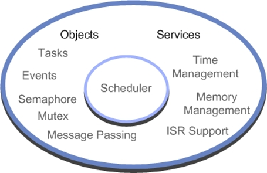

# Tutorial {#rtos2_tutorial}

This tutorial is an introduction to using a small footprint real-time operating system on an Arm Cortex-M microcontroller.

If you are used to writing procedural-based 'C' code on small 8-/16-bit microcontrollers, you may be doubtful about the need for such an operating system. If you are not familiar with using an RTOS in real-time embedded systems, you should read this chapter before dismissing the idea. The use of an RTOS represents a more sophisticated design approach, inherently fostering structured code development which is enforced by the RTOS application programming interface (API).

The RTOS structure allows you to take a more object-orientated design approach, while still programming in 'C'. The RTOS also provides you with multithreaded support on a small microcontroller. These two features actually create quite a shift in design philosophy, moving us away from thinking about procedural ‘C’ code and flow charts. Instead we consider the fundamental program threads and the flow of data between them. The use of an RTOS also has several additional benefits which may not be immediately obvious. Since an RTOS based project is composed of well-defined threads, it helps to improve project management, code reuse, and software testing.

The tradeoff for this is that an RTOS has additional memory requirements and increased interrupt latency. Typically, the Keil RTX5 RTOS will require 500 bytes of RAM and 5k bytes of code, but remember that some of the RTOS code would be replicated in your program anyway. We now have a generation of small low-cost microcontrollers that have enough on-chip memory and processing power to support the use of an RTOS. Developing using this approach is therefore much more accessible.

We will first look at setting up an introductory RTOS project for a Cortex-M based microcontroller. Next, we
will go through each of the RTOS primitives and how they influence the design of our application code. Finally, when we have a clear understanding of the RTOS features, we will take a closer look at the RTOS configuration options. If you are used to programming a microcontroller without using an RTOS i.e. bare metal, there are two key things to understand as you work through this tutorial. In the first section, we will focus on creating and managing Threads. The key concept here is to consider them running as parallel concurrent objects. In the second section, we will look at how to communicate between threads. In this section the key concept is synchronization of the concurrent threads.

## Prerequisites {#rtos2_tutorial_pre}

It is assumed that you have Keil MDK installed on your PC. For download and installation instructions, please visit
the [Getting Started](https://developer.arm.com/documentation/101407/latest/About-uVision/Installation) page. Once you have set up the tool,
open [Pack Installer](https://developer.arm.com/documentation/101407/latest/Creating-Applications/Software-Components/Pack-Installer):

- Use the **Search** box on the **Devices** tab to look for the **STM32F103** device.
- On the **Packs** tab, download and install the latest **Keil:STM32F1xx_DFP** pack and the latest **Hitex:CMSIS_RTOS2_Turorial** pack.

> **Note**
>
> - It is assumed that you are familiar with Arm Keil MDK and have basic 'C' programming knowledge.

## First Steps with Keil RTX5 {#rtos2_tutorial_first_steps}

The RTOS itself consists of a scheduler which supports round-robin, pre-emptive and co-operative multitasking of program threads, as well as time and memory management services. Inter-thread communication is supported by additional RTOS objects, including signal thread and event flags, semaphores, mutex, message passing and a memory pool system. As we will see, interrupt handling can also be accomplished by prioritized threads which are scheduled by the RTOS kernel.



## Accessing the CMSIS-RTOS2 API {#rtos2_tutorial_access}

To access any of the CMSIS-RTOS2 features in our application code, it is necessary to include the following header file.

```c
#include <cmsis_os2.h>
```

This header file is maintained by Arm as part of the CMSIS-RTOS2 standard. For Keil RTX5, this is the default API. Other RTOS will have their own proprietary API but may provide a wrapper layer to implement the CMSIS-RTOS2 API so they can be used where compatibility with the CMSIS standard is required.

## Threads {#rtos2_tutorial_threads}

The building blocks of a typical 'C' program are functions which we call to perform a specific procedure and which then return to the calling function. In CMSIS-RTOS2, the basic unit of execution is a "Thread". A Thread is very similar to a 'C' procedure but has some very fundamental differences.

```c
unsigned int procedure (void) {
  ...
    return(ch);
}
 
void thread (void) {
  while(1) {
    ...
    }
}
 
__NO_RETURN void Thread1(void*argument) {
  while(1) {
    ...
  }
}
```

While we always return from our 'C' function, once started an RTOS thread must contain a loop so that it never terminates and thus runs forever. You can think of a thread as a mini self-contained program that runs within the RTOS. With the Arm Compiler, it is possible to optimize a thread by using a `__NO_RETURN` macro. This attribute reduces the cost of calling a function that never returns.

An RTOS program is made up of a number of threads, which are controlled by the RTOS scheduler. This scheduler uses the SysTick timer to generate a periodic interrupt as a time base. The scheduler will allot a certain amount of execution time to each thread. So `thread1` will run for 5 ms then be de-scheduled to allow `thread2` to run for a similar period; `thread2` will give way to `thread3` and finally control passes back to `thread1`. By allocating these slices of runtime to each thread in a round-robin fashion, we get the appearance of all three threads running in parallel to each other.

Conceptually we can think of each thread as performing a specific functional unit of our program with all threads running simultaneously. This leads us to a more object-orientated design, where each functional block can be coded and tested in isolation and then integrated into a fully running program. This not only imposes a structure on the design of our final application but also aids debugging, as a particular bug can be easily isolated to a specific thread. It also aids code reuse in later projects. When a thread is created, it is also allocated its own thread ID. This is a variable which acts as a handle for each thread and is used when we want to manage the activity of the thread.

```c
osThreadId_t id1, id2, id3;
```

In order to make the thread-switching process happen, we have the code overhead of the RTOS and we have to dedicate a CPU hardware timer to provide the RTOS time reference. In addition, each time we switch running threads, we have to save the state of all the thread variables to a thread stack. Also, all the runtime information about a thread is stored in a thread
control block, which is managed by the RTOS kernel. Thus the “context switch time”, that is, the time to save the current thread state and load up and start the next thread, is a crucial figure and will depend on both the RTOS kernel and the design of the underlying hardware.

The Thread Control Block contains information about the status of a thread. Part of this information is its run state. In a given system, only one thread can be running and all the others will be suspended but ready to run. The RTOS has various methods of inter-thread communication (signals, semaphores, messages). Here, a thread may be suspended to wait to be signaled by another thread or interrupt before it resumes its ready state, whereupon it can be placed into running state by the RTOS scheduler.

| State   | Description |
|---------|-------------|
| Running | The currently running thread |
| Ready   | Threads ready to run |
| Wait    | Blocked threads waiting for an OS event |

At any given moment a single thread may be running. The remaining threads will be ready to run and will be scheduled by the kernel. Threads may also be waiting pending an OS event. When this occurs they will return to the ready state and be scheduled by the kernel.

## Starting the RTOS {#rtos2_tutorial_start}

To build a simple RTOS, program we declare each thread as a standard 'C' function and also declare a thread ID variable for each function.

```c
void thread1 (void);
void thread2 (void);
 
osThreadId thrdID1, thrdID2;
```

Once the processor leaves the reset vector, we will enter the `main()` function as normal. Once in `main()`, we must call \ref osKernelInitialize() to setup the RTOS. It is not possible to call any RTOS function before the \ref osKernelInitialize() function has successfully completed. Once \ref osKernelInitialize() has completed, we can create further threads and other RTOS objects. This can be done by creating a launcher thread, in the example below this is called `app_main()`. Inside the `app_main()` thread, we create all the RTOS threads and objects we need to start our application running. As we will see later, it is also possible to dynamically create and destroy RTOS objects as the application is running. Next, we can call \ref osKernelStart() to start the RTOS and the scheduler task switching. You can run any initializing code you want before starting the RTOS to setup peripherals and initialize the hardware.

```c
void app_main(void *argument) {
  T_led_ID1 = osThreadNew(led_Thread1, NULL, &ThreadAttr_LED1);
  T_led_ID2 = osThreadNew(led_Thread2, NULL, &ThreadAttr_LED2);
  osDelay(osWaitForever);
  while (1)
    ;
}
 
void main(void) {
  IODIR1 = 0x00FF0000;               // Do any C code you want
  osKernelInitialize();              // Initialize the kernel
  osThreadNew(app_main, NULL, NULL); // Create the app_main() launcher thread
  osKernelStart();                   // Start the RTOS
}
```

When threads are created they are also assigned a priority. If there are a number of threads ready to run and they all have the same priority, they will be allotted run time in a round-robin fashion. However, if a thread with a higher priority becomes ready to run, the RTOS scheduler will de-schedule the currently running thread and start the high priority thread running. This is called pre-emptive priority-based scheduling. When assigning priorities, you have to be careful because the high priority thread will continue to run until it enters a waiting state or until a thread of equal or higher priority is ready to run.

### Exercise 1 - A First CMSIS-RTOS2 Project {#rtos2_tutorial_ex1}

Open [Pack Installer](https://developer.arm.com/documentation/101407/latest/Creating-Applications/Software-Components/Pack-Installer):

- Use the **Search** box on the **Boards** tab to look for the **CMSIS_RTOS2_Tutorial (V2.1)** "board".
- On the **Examples** tab, copy **Ex 01 First Project** to your PC and start Keil MDK.
- In the project folder, you will find a file called "Instructions.pdf" that explains the setup and the steps you need to take to successfully finish the exercise.

## Creating Threads {#rtos2_tutorial_thread_create}

Once the RTOS is running, there are a number of system calls that are used to manage and control the active threads. The documentation lists \ref CMSIS_RTOS_ThreadMgmt "all thread management functions".

As we saw in the first example, the `app_main()` thread is used as a launcher thread to create the application threads. This is done in two stages. First a thread structure is defined; this allows us to define the thread operating parameters.

```c
osThreadId thread1_id; // thread handle
 
static const osThreadAttr_t threadAttr_thread1 = {
    “Name_String ",      //Human readable Name for debugger
    Attribute_bits Control_Block_Memory,
    Control_Block_Size,
    Stack_Memory,
    Stack_Size,
    Priority,
    TrustZone_ID,
    reserved};
```

The thread structure requires us to define the name of the thread function, its thread priority, any special attribute bits, its TrustZone_ID and its memory allocation. This is quite a lot of detail to go through but we will cover everything by the end of this application note. Once the thread structure has been defined, the thread can be created using the \ref osThreadNew API call. Then the thread is created from within the application code, this is often the within the `app_main()` thread but a thread can be created at any point within any thread.

```c
thread1_id = osThreadNew(name_Of_C_Function, argument,&threadAttr_thread1);
```

This creates the thread and starts it running. It is also possible to pass a parameter to the thread when it starts.

```c
uint32_t startupParameter = 0x23;
thread1_id = osThreadNew(name_Of_C_Function, (uint32_t)startupParameter,&threadAttr_thread1);
```

### Exercise 2 - Creating and Managing Threads {#rtos2_tutorial_ex2}

Open [Pack Installer](https://developer.arm.com/documentation/101407/latest/Creating-Applications/Software-Components/Pack-Installer):

- Use the **Search** box on the **Boards** tab to look for the **CMSIS_RTOS2_Tutorial (V2.1)** "board".
- On the **Examples** tab, copy **Ex 02 Threads** to your PC and start Keil MDK.
- In the project folder, you will find a file called "Instructions.pdf" that explains the setup and the steps you need to take to successfully finish the exercise.

## Thread Management and Priority {#rtos2_tutorial_thread_mgmt}

When a thread is created it is assigned a priority level. The RTOS scheduler uses a thread’s priority to decide which thread should be scheduled to run. If a number of threads are ready to run, the thread with the highest priority will be placed in the run state. If a high priority thread becomes ready to run it will preempt a running thread of lower priority.

Importantly, a high priority thread running on the CPU will not stop running unless it blocks on an RTOS API call or is preempted by a higher priority thread. A thread's priority is defined in the thread structure and the following priority definitions are available. The default priority is `osPriorityNormal`. The \ref osPriority_t value specifies the priority for a thread.

Once the threads are running, there are a small number of RTOS system calls which are used to manage the running threads. It is also then possible to elevate or lower a thread’s priority either from another function or from within its own code.

```c
osStatus   osThreadSetPriority(threadID, priority);
osPriority osThreadGetPriority(threadID);
```

As well as creating threads, it is also possible for a thread to delete another active thread from the RTOS. Again, we use the thread ID rather than the function name of the thread.

```c
osStatus = osThreadTerminate (threadID1);
```

If a thread wants to terminate itself then there is a dedicated exit function.

```c
osThreadExit (void)
```

Finally, there is a special case of thread switching where the running thread passes control to the next ready thread of the same priority. This is used to implement a third form of scheduling called co-operative thread switching.

```c
osStatus osThreadYield();      //switch to next ready to run thread at the same priority
```

## Memory Management {#rtos2_tutorial_ex2_mem_mgmt}

When each thread is created, it is assigned its own stack for storing data during the context switch. This should not be confused with the native Cortex-M processor stack; it is really a block of memory that is allocated to the thread.

A default stack size is defined in the RTOS configuration file (we will see this later) and this amount of memory will be allocated to each thread unless we override it to allocate a custom size. The default stack size will be assigned to a thread if the stack size value in the thread definition structure is set to zero. If necessary a thread can be given additional memory resources by defining a bigger stack size in the thread structure.

Keil RTX5 supports several memory models to assign this thread memory. The default model is a global memory pool. In this model each RTOS object that is created (threads, message queues, semaphores etc.) are allocated memory from a single block of memory.

If an object is destroyed the memory it has been assigned is returned to the memory pool. This has the advantage of memory reuse but also introduces the possible problem of memory fragmentation.

The size of the global memory pool is defined in the configuration file:

```c
#define OS_DYNAMIC_MEM_SIZE         4096
```

And the default stack size for each thread is defined in the threads section:

```c
#define OS_STACK_SIZE               256
```

It is also possible to define object specific memory pools for each different type of RTOS object. In this model you define the maximum number of a specific object type and its memory requirements. The RTOS then calculates and reserves the required memory usage.

The object specific model is again defined in the RTOS configuration file by enabling the "object specific memory" option provided in each section of the configuration file:

```c
#define OS_SEMAPHORE_OBJ_MEM        1
#define OS_SEMAPHORE_NUM            1
```

In the case of simple object which requires a fixed memory allocation we just need to define the maximum number of a given object type. In the case of more complex objects such as threads we will need to define the required memory usage:

```c
#define OS_THREAD_OBJ_MEM           1
#define OS_THREAD_NUM               1
#define OS_THREAD_DEF_STACK_NUM     0
#define OS_THREAD_USER_STACK_SIZE   1024
```

To use the object specific memory allocation model with threads we must provide details of the overall thread memory usage.

Finally it is possible to statically allocate the thread stack memory. This is important for safety related systems where memory usage has to be rigorously defined.

### Exercise 3 - Memory Model {#rtos2_tutorial_ex3}

Open [Pack Installer](https://developer.arm.com/documentation/101407/latest/Creating-Applications/Software-Components/Pack-Installer):

- Use the **Search** box on the **Boards** tab to look for the **CMSIS_RTOS2_Tutorial (V2.1)** "board".
- On the **Examples** tab, copy **Ex 03 Memory Model** to your PC and start Keil MDK.
- In the project folder, you will find a file called "Instructions.pdf" that explains the setup and the steps you need to take to successfully finish the exercise.

## Multiple Instances {#rtos2_tutorial_multi_inst}

One of the interesting possibilities of an RTOS is that you can create multiple running instances of the same base thread code. For example, you could write a thread to control a UART and then create two running instances of the same thread code.

Here, each instance of the UART code could manage a different UART. Then we can create two instances of the thread assigned to different thread handles. A parameter is also passed to allow each instance to identify which UART it is responsible for.

```c
#define UART1 (void *) 1UL
#define UART2 (void *) 2UL
 
ThreadID_1_0 = osThreadNew (thread1, UART1, &ThreadAttr_Task1);
ThreadID_1_1 = osThreadNew (thread1, UART0, &ThreadAttr_Task1);
```

### Exercise 4 - Multiple Instances {#rtos2_tutorial_multi_inst_ex4}

Open [Pack Installer](https://developer.arm.com/documentation/101407/latest/Creating-Applications/Software-Components/Pack-Installer):

- Use the **Search** box on the **Boards** tab to look for the **CMSIS_RTOS2_Tutorial (V2.1)** "board".
- On the **Examples** tab, copy **Ex 04 Multiple Instances** to your PC and start Keil MDK.
- In the project folder, you will find a file called "Instructions.pdf" that explains the setup and the steps you need to take to successfully finish the exercise.

## Joinable Threads {#rtos2_tutorial_thread_join}

A new feature in CMSIS-RTOS2 is the ability to create threads in a 'joinable' state. This allows a thead to be created and executed as a standard thread. In addition, a second thread can join it by calling \ref osThreadJoin(). This will cause the second thread to deschedule and remain in a waiting state until the thread which has been joined is terminated. This allows a temporary joinable thread to be created, which would acquire a block of memory from the global memory pool, this thread could perform some processing and then terminate, releasing the memory back to the memory pool.

A joinable thread can be created by setting the joinable attribute bit in the thread attributes structure as shown below:

```c
static const osThreadAttr_t ThreadAttr_worker = {
    .attr_bits = osThreadJoinable
};
```

Once the thread has been created, it will execute following the same rules as 'normal' threads. Any other thread can then join it by using the OS call:

```c
osThreadJoin(<joinable_thread_handle>);
```

Once \ref osThreadJoin has been called, the thread will deschedule and enter a waiting state until the joinable thread has terminated.

### Exercise 5 - Joinable Threads {#rtos2_tutorial_ex4}

Open [Pack Installer](https://developer.arm.com/documentation/101407/latest/Creating-Applications/Software-Components/Pack-Installer):

- Use the **Search** box on the **Boards** tab to look for the **CMSIS_RTOS2_Tutorial (V2.1)** "board".
- On the **Examples** tab, copy **Ex 05 Join** to your PC and start Keil MDK.
- In the project folder, you will find a file called "Instructions.pdf" that explains the setup and the steps you need to take to successfully finish the exercise.

## Time Management {#rtos2_tutorial_time_mgmt}

As well as running your application code as threads, the RTOS also provides some timing services which can be accessed through RTOS system calls.

### Time Delay {#rtos2_tutorial_time_delay}

The most basic of these timing services is a simple timer delay function. This is an easy way of providing timing delays
within your application. Although the RTOS kernel size is quoted as 5 KB, features such as delay loops and simple scheduling
loops are often part of a non-RTOS application and would consume code bytes anyway, so the overhead of the RTOS can be less
than it immediately appears.

```c
void osDelay (uint32_t ticks)
```

This call will place the calling thread into the WAIT_DELAY state for the specified number of milliseconds. The scheduler
will pass execution to the next thread in the READY state.

When the timer expires, the thread will leave the WAIT_DELAY  state and move to the READY state. The thread will resume
running when the scheduler moves it to the RUNNING state. If the thread then continues executing without any further
blocking OS calls, it will be descheduled at the end of its time slice and be placed in the ready state, assuming another
thread of the same priority is ready to run.

### Absolute Time Delay {#rtos2_tutorial_abs_time_delay}

In addition to the \ref osDelay function which gives a relative time delay starting from the instant it is called, there
is also a delay function which halts a thread until a specific point in time:

```c
osStatus osDelayUntil (uint32_t ticks)
```

The \ref osDelayUntil function will halt a thread until a specific value of kernel timer ticks is reached. There are a
number of kernel functions that allow you to read both the current SysTick count and the kernel ticks count.

| Kernel timer functions |
|------------------------|
| uint64_t \ref osKernelGetTickCount(void)     |
| uint32_t \ref osKernelGetTickFreq(void)      |
| uint32_t \ref osKernelGetSysTimerCount(void) |
| uint32_t \ref osKernelGetSysTimerFreq(void)  |

### Exercise 6 - Time Management {#rtos2_tutorial_ex6}

Open [Pack Installer](https://developer.arm.com/documentation/101407/latest/Creating-Applications/Software-Components/Pack-Installer):

- Use the **Search** box on the **Boards** tab to look for the **CMSIS_RTOS2_Tutorial (V2.1)** "board".
- On the **Examples** tab, copy **Ex 06 Time Management** to your PC and start Keil MDK.
- In the project folder, you will find a file called "Instructions.pdf" that explains the setup and the steps you need to take to successfully finish the exercise.

### Virtual Timers {#rtos2_tutorial_virtual_timers}

The CMSIS-RTOS API can be used to define any number of virtual timers which act as count down timers. When they expire, they
will run a user call-back function to perform a specific action. Each timer can be configured as a one shot or repeat timer.
A virtual timer is created by first defining a timer structure:

```c
static const struct osTimerAttr_t timerAttr_timer0 = {
  const char* name;      ///< name of the timer
  uint32_t    attr_bits; ///< attribute bits
  void*       cb_mem;    ///< memory for control block
  uint32_t    cb_size;   ///< size of provided memory for control block
}
```

This defines a name for the timer. The timer must then be instantiated by an RTOS
thread providing a pointer to the callback function and its parameter.:

```c
osTimerId_t timer0_handle;
timer0_handle = osTimerNew(&callback, osTimerPeriodic,(void *)<parameter>, &timerAttr_timer0);
```

This creates the timer and defines it as a periodic timer or a single shot timer (\ref osTimerOnce()). The next parameter
passes an argument to the call back function when the timer expires:

```c
osTimerStart (timer0_handle,0x100);
```

The timer can then be started at any point in a thread the timer start function invokes the timer by its handle and defines
a count period in kernel ticks.

### Exercise 7 - Virtual Timer {#rtos2_tutorial_ex7}

Open [Pack Installer](https://developer.arm.com/documentation/101407/latest/Creating-Applications/Software-Components/Pack-Installer):

- Use the **Search** box on the **Boards** tab to look for the **CMSIS_RTOS2_Tutorial (V2.1)** "board".
- On the **Examples** tab, copy **Ex 07 Virtual Timers** to your PC and start Keil MDK.
- In the project folder, you will find a file called "Instructions.pdf" that explains the setup and the steps you need to take to successfully finish the exercise.

### Idle Thread {#rtos2_tutorial_idle_thread}

The final timer service provided by the RTOS isn't really a timer, but this is probably the best place to discuss it. If
during our RTOS program we have no thread running and no thread ready to run (e.g. they are all waiting on delay functions),
then the RTOS will start to run the Idle Thread. This thread is automatically created when the RTOS starts and runs at the
lowest priority. The Idle Thread function is located in the RTX_Config.c file:

```c
__WEAK __NO_RETURN void osRtxIdleThread (void *argument) {
  (void)argument;
 
  for (;;) {}
}
```

You can add any code to this thread, but it has to obey the same rules as user threads. The simplest use of the idle demon
is to place the microcontroller into a low-power mode when it is not doing anything.

```c
__WEAK __NO_RETURN void osRtxIdleThread (void *argument) {
  (void)argument;
 
  for (;;) {
    __WFE();
  }
}
```

What happens next depends on the power mode selected in the microcontroller. At a minimum, the CPU will halt until an
interrupt is generated by the SysTick timer and execution of the scheduler will resume. If there is a thread ready to run,
then execution of the application code will resume. Otherwise, the idle demon will be reentered and the system will go back
to sleep.

### Exercise 8 - Idle Thread {#rtos2_tutorial_ex8}

Open [Pack Installer](https://developer.arm.com/documentation/101407/latest/Creating-Applications/Software-Components/Pack-Installer):

- Use the **Search** box on the **Boards** tab to look for the **CMSIS_RTOS2_Tutorial (V2.1)** "board".
- On the **Examples** tab, copy **Ex 08 Idle Thread** to your PC and start Keil MDK.
- In the project folder, you will find a file called "Instructions.pdf" that explains the setup and the steps you need to take to successfully finish the exercise.

## Inter-thread Communication {#rtos2_tutorial_interthread_com}

So far, we have seen how application code can be defined as independent threads and how we can access the timing services
provided by the RTOS. In a real application, we need to be able to communicate between threads in order to make an
application useful. To this end, a typical RTOS supports several different communication objects which can be used to link
the threads together to form a meaningful program. The CMSIS-RTOS2 API supports inter-thread communication with thread and
event flags, semaphores, mutexes, mailboxes and message queues. In the first section, the key concept was concurrency. In
this section, the key concept is synchronizing the activity of multiple threads.

### Thread Flags {#rtos2_tutorial_thread_flags}

Keil RTX5 supports up to thirty two thread flags for each thread. These thread flags are stored in the thread control block.
It is possible to halt the execution of a thread until a particular thread flag or group of thread flags are set by another
thread in the system.

The \ref osThreadFlagsWait system calls will suspend execution of the thread and place it into the wait_evnt state.
Execution of the thread will not start until at least one the flags set in the \ref osThreadFlagsWait API call have been
set. It is also possible to define a periodic timeout after which the waiting thread will move back to the ready state, so
that it can resume execution when selected by the scheduler. A value of \ref osWaitForever (0xFFFF) defines an infinite
timeout period.

```c
osEvent osThreadFlagsWait (int32_t flags,int32_t options,uint32_t timeout);
```

The thread flag options are as follows:

| Options             | Description |
|---------------------|-------------|
| \ref osFlagsWaitAny | Wait for any flag to be set(default) |
| \ref osFlagsWaitAll | Wait for all flags to be set |
| \ref osFlagsNoClear | Do not clear flags that have been specified to wait for |

If a pattern of flags is specified, the thread will resume execution when any one of the specified flags is set (Logic OR).
If the \ref osFlagsWaitAll option is used, then all the flags in the pattern must be set (Logic AND). Any thread can set a
flag on any other thread and a thread may clear its own flags:

```c
int32_t osThredFlagsSet (osThreadId_t  thread_id, int32_t flags);
int32_t osThreadFlagsClear (int32_t signals);
```

#### Exercise 9 - Thread Flags {#rtos2_tutorial_ex9}

Open [Pack Installer](https://developer.arm.com/documentation/101407/latest/Creating-Applications/Software-Components/Pack-Installer):

- Use the **Search** box on the **Boards** tab to look for the **CMSIS_RTOS2_Tutorial (V2.1)** "board".
- On the **Examples** tab, copy **Ex 09 Thread Flags** to your PC and start Keil MDK.
- In the project folder, you will find a file called "Instructions.pdf" that explains the setup and the steps you need to take to successfully finish the exercise.

### Event Flags {#rtos2_tutorial_event_flags}

Event flags operate in a similar fashion to thread flags but must be created and then act as a global RTOS object that can
be used by all the running threads.

First, we need to create a set of event flags, this is a similar process to creating a thread. We define an event flag
attribute structure. The attribute structure defines an ASCII name string, attribute bits, and memory detention. If we are
using the static memory model.

```c
osEventFlagsAttr_t {
  const char *name;   ///< name of the event flags
  uint32_t attr_bits; ///< attribute bits (none)
  void *cb_mem;       ///< memory for control block
  uint32_t cb_size;   ///< size of provided memory for control block
};
```

Next we need a handle to control access the event flags:

```c
osEventFlagsId_t EventFlag_LED;
```

Then we can create the event flag object:

```c
EventFlag_LED = osEventFlagsNew(&EventFlagAttr_LED);
```

Refer to \ref CMSIS_RTOS_EventFlags for more information.

#### Exercise 10 - Event Flags {#rtos2_tutorial_ex10}

Open [Pack Installer](https://developer.arm.com/documentation/101407/latest/Creating-Applications/Software-Components/Pack-Installer):

- Use the **Search** box on the **Boards** tab to look for the **CMSIS_RTOS2_Tutorial (V2.1)** "board".
- On the **Examples** tab, copy **Ex 10 Event Flags** to your PC and start Keil MDK.
- In the project folder, you will find a file called "Instructions.pdf" that explains the setup and the steps you need to take to successfully finish the exercise.

### Semaphores {#rtos2_tutorial_semaphores}

Like thread flags, semaphores are a method of synchronizing activity between two or more threads. Put simply, a semaphore is
a container that holds a number of tokens. As a thread executes, it will reach an RTOS call to acquire a semaphore token. If
the semaphore contains one or more tokens, the thread will continue executing and the number of tokens in the semaphore will
be decremented by one. If there are currently no tokens in the semaphore, the thread will be placed in a waiting state until
a token becomes available. At any point in its execution, a thread may add a token to the semaphore causing its token count
to increment by one.

The diagram above illustrates the use of a semaphore to synchronize two threads. First, the semaphore must be created and
initialized with an initial token count. In this case the semaphore is initialized with a single token. Both threads will
run and reach a point in their code where they will attempt to acquire a token from the semaphore. The first thread to reach
this point will acquire the token from the semaphore and continue execution. The second thread will also attempt to acquire
a token, but as the semaphore is empty it will halt execution and be placed into a waiting state until a semaphore token is
available.

Meanwhile, the executing thread can release a token back to the semaphore. When this happens, the waiting thread will
acquire the token and leave the waiting state for the ready state. Once in the ready state the scheduler will place the
thread into the run state so that thread execution can continue. While semaphores have a simple set of OS calls they can be
one of the more difficult OS objects to fully understand. In this section, we will first look at how to add semaphores to an
RTOS program and then go on to look at the most useful semaphore applications.

To use a semaphore in the CMSIS-RTOS you must first declare a semaphore attributes:

```c
osSemaphoreAttr_t {
  const char *name;   ///< name of the semaphore
  uint32_t attr_bits; ///< attribute bits (none)
  void *cb_mem;       ///< memory for control block
  uint32_t cb_size;   ///< size of provided memory for control block
};
```

Next declare the semaphore handle:

```c
osSemaphoreId_t sem1;
```

Then within a thread the semaphore container can be initialised with a number of tokens:

```c
sem1 = osSemaphoreNew(maxTokenCount,initalTokencount,&osSemaphoreAttr_t);
```

It is important to understand that semaphore tokens may also be created and destroyed as threads run. So for example you can
initialise a semaphore with zero tokens and then use one thread to create tokens into the semaphore while another thread
removes them. This allows you to design threads as producer and consumer threads.

Once the semaphore is initialized, tokens may be acquired and sent to the semaphore in a similar fashion to event flags. The
\ref osSemaphoreAcquire() call is used to block a thread until a semaphore token is available. A timeout period may also be
specified with 0xFFFF being an infinite wait.

```c
osStatus osSemaphoreAcquire(osSemaphoreId_t semaphore_id, uint32_t ticks);
```

Once the thread has finished using the semaphore resource, it can send a token to the semaphore container:

```c
osStatus osSemaphoreRelease(osSemaphoreId_t semaphore_id);
```

All semaphore functions are listed in the \ref CMSIS_RTOS_SemaphoreMgmt "API reference".

#### Using Semaphores {#rtos2_tutorial_sem_usage}

Although semaphores have a simple set of OS calls, they have a wide range of synchronizing applications. This makes them
perhaps the most challenging RTOS object to understand. In this section we, will look at the most common uses of semaphores.
These are taken from free book [The Little Book Of Semaphores](https://greenteapress.com/wp/semaphores/) by Allen B. Downey.

#### Signalling {#rtos2_tutorial_sem_sig}

Synchronizing the execution of two threads is the simplest use of a semaphore:

```c
osSemaphoreId_t sem1;
static const osSemaphoreAttr_t semAttr_SEM1 = {
    .name = "SEM1",
};
 
void thread1(void) {
  sem1 = osSemaphoreNew(5, 0, &semAttr_SEM1);
  while (1) {
    FuncA();
    osSemaphoreRelease(sem1)
  }
}
 
void task2(void) {

  while (1) {
    osSemaphoreAcquire(sem1, osWaitForever) FuncB();
  }
}
```

In this case the semaphore is used to ensure that the code in `FuncA()` is executed before the code in `FuncB()`.

#### Exercise 11 - Semaphore Signalling {#rtos2_tutorial_ex11}

Open [Pack Installer](https://developer.arm.com/documentation/101407/latest/Creating-Applications/Software-Components/Pack-Installer):

- Use the **Search** box on the **Boards** tab to look for the **CMSIS_RTOS2_Tutorial (V2.1)** "board".
- On the **Examples** tab, copy **Ex 11 Semaphore Signalling** to your PC and start Keil MDK.
- In the project folder, you will find a file called "Instructions.pdf" that explains the setup and the steps you need to take to successfully finish the exercise.

#### Multiplex {#rtos2_tutorial_sem_multi}

A multiplex is used to limit the number of threads that can access a critical section of code. For example, this could be a
routine that accesses memory resources and can only support a limited number of calls.

```c
osSemaphoreId_t multiplex;
static const osSemaphoreAttr_t semAttr_Multiplex = {
    .name = "SEM1",
};
 
void thread1(void) {
  multiplex = osSemaphoreCreate(5, 5, &semAttr_Multiplex);
  while (1) {
    osSemaphoreAcquire(multiplex, osWaitForever);
    processBuffer();
    osSemaphoreRelease(multiplex);
  }
}
```

In this example we initialise the multiplex semaphore with five tokens. Before a thread can call the `processBuffer()`
function, it must acquire a semaphore token. Once the function has completed, the token is sent back to the semaphore. If
more than five threads are attempting to call `processBuffer()`, the sixth must wait until a thread has finished with
`processBuffer()` and returns its token. Thus, the multiplex semaphore ensures that a maximum of five threads can call the
`processBuffer()` function "simultaneously".

#### Exercise 12 - Multiplex {#rtos2_tutorial_ex12}

Open [Pack Installer](https://developer.arm.com/documentation/101407/latest/Creating-Applications/Software-Components/Pack-Installer):

- Use the **Search** box on the **Boards** tab to look for the **CMSIS_RTOS2_Tutorial (V2.1)** "board".
- On the **Examples** tab, copy **Ex 12 Multiplex** to your PC and start Keil MDK.
- In the project folder, you will find a file called "Instructions.pdf" that explains the setup and the steps you need to take to successfully finish the exercise.

#### Rendezvous {#rtos2_tutorial_sem_rend}

A more generalised form of semaphore signalling is a rendezvous. A rendezvous ensures that two threads reach a certain point
of execution. Neither may continue until both have reached the rendezvous point.

```c
osSemaphoreId_t arrived1, arrived2;
static const osSemaphoreAttr_t semAttr_Arrived1 = {
    .name = "Arr1",
};
 
static const osSemaphoreAttr_t semAttr_Arrived2 = {
    .name = "Arr2",
};
 
void thread1(void) {
  arrived1 = osSemaphoreNew(2, 0);
  arrived1 = osSemaphoreNew(2, 0);
  while (1) {
    FuncA1();
    osSemaphoreRelease(arrived1);
    osSemaphoreAcquire(arrived2, osWaitForever);
    FuncA2();
  }
}
 
void thread2(void) {
  while (1) {
    FuncB1();
    os_sem_Release(arrived2);
    os_sem_Acquire(arrived1, osWaitForever);
    FuncB2();
  }
}
```

In the above case, the two semaphores will ensure that both threads will rendezvous and then proceed to execute `FuncA2()`
and `FuncB2()`.

#### Exercise 13 - Rendezvous {#rtos2_tutorial_sem_rend_ex13}

Open [Pack Installer](https://developer.arm.com/documentation/101407/latest/Creating-Applications/Software-Components/Pack-Installer):

- Use the **Search** box on the **Boards** tab to look for the **CMSIS_RTOS2_Tutorial (V2.1)** "board".
- On the **Examples** tab, copy **Ex 13 Rendezvous** to your PC and start Keil MDK.
- In the project folder, you will find a file called "Instructions.pdf" that explains the setup and the steps you need to take to successfully finish the exercise.

#### Barrier Turnstile {#rtos2_tutorial_sem_barr_turn}

Although a rendezvous is very useful for synchronising the execution of code, it only works for two functions. A barrier is
a more generalised form of rendezvous which works to synchronise multiple threads.

```c
osSemaphoreId_t count, barrier;
static const osSemaphoreAttr_t semAttr_Counter = {
    .name = "Counter",
};
 
static const osSemaphoreAttr_t semAttr_Barier = {
    .name = "Barrier",
};
 
unsigned int count;
 
void thread1(void) {
  Turnstile_In = osSemaphoreNew(5, 0, &semAttr_SEM_In);
  Turnstile_Out = osSemaphoreNew(5, 1, &semAttr_SEM_Out);
  Mutex = osSemaphoreNew(1, 1, &semAttr_Mutex);
  while (1) {
    osSemaphoreAcquire(Mutex, osWaitForever); // Allow one task at a time to
                                              // access the first turnstile
    count = count + 1; // Increment count
    if (count == 5) {
      osSemaphoreAcquire(Turnstile_Out,
                         osWaitForever); // Lock the second turnstile
      osSemaphoreRelease(Turnstile_In);  // Unlock the first turnstile
    }
    osSemaphoreRelease(Mutex); // Allow other tasks to access the turnstile
    osSemaphoreAcquire(Turnstile_In, osWaitForever); // Turnstile Gate
    osSemaphoreRelease(Turnstile_In);
    critical_Function();
  }
}
```

In this code, we use a global variable to count the number of threads which have arrived at the barrier. As each function
arrives at the barrier it will wait until it can acquire a token from the counter semaphore. Once acquired, the count
variable will be incremented by one. Once we have incremented the count variable, a token is sent to the counter semaphore
so that other waiting threads can proceed. Next, the barrier code reads the count variable. If this is equal to the number
of threads which are waiting to arrive at the barrier, we send a token to the barrier semaphore.

In the example above we are synchronising five threads. The first four threads will increment the count variable and then
wait at the barrier semaphore. The fifth and last thread to arrive will increment the count variable and send a token to the
barrier semaphore. This will allow it to immediately acquire a barrier semaphore token and continue execution. After passing
through the barrier, it immediately sends another token to the barrier semaphore. This allows one of the other waiting
threads to resume execution. This thread places another token in the barrier semaphore which triggers another waiting thread
and so on. This final section of the barrier code is called a turnstile because it allows one thread at a time to pass the
barrier. In our model of concurrent execution this means that each thread waits at the barrier until the last arrives then
the all resume simultaneously. In the following exercise we create five instances of one thread containing barrier code.
However, the barrier could be used to synchronise five unique threads.

#### Exercise 14 - Semaphore Barrier {#rtos2_tutorial_ex14}

Open [Pack Installer](https://developer.arm.com/documentation/101407/latest/Creating-Applications/Software-Components/Pack-Installer):

- Use the **Search** box on the **Boards** tab to look for the **CMSIS_RTOS2_Tutorial (V2.1)** "board".
- On the **Examples** tab, copy **Ex 14 Barrier** to your PC and start Keil MDK.
- In the project folder, you will find a file called "Instructions.pdf" that explains the setup and the steps you need to take to successfully finish the exercise.

#### Semaphore Caveats {#rtos2_tutorial_sem_caveats}

Semaphores are an extremely useful feature of any RTOS. However semaphores can be misused. You must always remember that the
number of tokens in a semaphore is not fixed. During the runtime of a program semaphore tokens may be created and destroyed.
Sometimes this is useful, but if your code depends on having a fixed number of tokens available to a semaphore you must be
very careful to always return tokens back to it. You should also rule out the possibility of accidently creating additional
new tokens.

### Mutex {#rtos2_tutorial_mutex}

Mutex stands for “Mutual Exclusion”. In reality, a mutex is a specialized version of semaphore. Like a semaphore, a mutex is
a container for tokens. The difference is that a mutex can only contain one token which cannot be created or destroyed. The
principle use of a mutex is to control access to a chip resource such as a peripheral. For this reason a mutex token is
binary and bounded. Apart from this it really works in the same way as a semaphore. First of all we must declare the mutex
container and initialize the mutex:

```c
osMutexId_t uart_mutex;
 
osMutexAttr_t {
  const char *name;   ///< name of the mutex
  uint32_t attr_bits; ///< attribute bits
  void *cb_mem;       ///< memory for control block
  uint32_t cb_size;   ///< size of provided memory for control block
};
```

When a mutex is created its functionality can be modified by setting the following attribute bits:

| Bitmask                 | Description |
|-------------------------|-------------|
| \ref osMutexRecursive   | The same thread can consume a mutex multiple times without locking itself.        |
| \ref osMutexPrioInherit | While a thread owns the mutex it cannot be preempted by a higher priority thread. |
| \ref osMutexRobust      | Notify threads that acquire a mutex that the previous owner was terminated.       |

Once declared the mutex must be created in a thread.

```c
uart_mutex = osMutexNew(&MutexAttr);
```

Then any thread needing to access the peripheral must first acquire the mutex token:

```c
osMutexAcquire(osMutexId_t mutex_id,uint32_t ticks);
```

Finally, when we are finished with the peripheral the mutex must be released:

```c
osMutexRelease(osMutexId_t mutex_id);
```

Mutex use is much more rigid than semaphore use, but is a much safer mechanism when controlling absolute access to
underlying chip registers.

#### Exercise 15 - Mutex {#rtos2_tutorial_ex15}

Open [Pack Installer](https://developer.arm.com/documentation/101407/latest/Creating-Applications/Software-Components/Pack-Installer):

- Use the **Search** box on the **Boards** tab to look for the **CMSIS_RTOS2_Tutorial (V2.1)** "board".
- On the **Examples** tab, copy **Ex 15 Mutex** to your PC and start Keil MDK.
- In the project folder, you will find a file called "Instructions.pdf" that explains the setup and the steps you need to take to successfully finish the exercise.

#### Mutex Caveats {#rtos2_tutorial_mutex_caveats}

Clearly, you must take care to return the mutex token when you are finished with the chip resource, or you will have
effectively prevented any other thread from accessing it. You must also be extremely careful about using the
\ref osThreadTerminate() call on functions which control a mutex token. Keil RTX5 is designed to be a small footprint RTOS
so that it can run on even the very small Cortex-M microcontrollers. Consequently, there is no thread deletion safety. This
means that if you delete a thread which is controlling a mutex token, you will destroy the mutex token and prevent any
further access to the guarded peripheral.

### Data Exchange {#rtos2_tutorial_data_exchange}

So far, all of the inter-thread communication methods have only been used to trigger execution of threads; they do not
upport the exchange of program data between threads. Clearly, in a real program we will need to move data between threads.
This could be done by reading and writing to globally declared variables. In anything but a very simple program, trying to
guarantee data integrity would be extremely difficult and prone to unforeseen errors. The exchange of data between threads
needs a more formal asynchronous method of communication.

CMSIS-RTOS provides two methods of data transfer between threads. The first method is a message queue which creates a
buffered data 'pipe' between two threads. The message queue is designed to transfer integer values.

The second form of data transfer is a mail queue. This is very similar to a message queue except that it transfers blocks of
data rather than a single integer.

Message and mail queues both provide a method for transferring data between threads. This allows you to view your design as
a collection of objects (threads) interconnected by data flows. The data flow is implemented by message and mail queues.
This provides both a buffered transfer of data and a well defined communication interface between threads. Starting with a
system level design based on threads connected by mail and message queues allows you to code different subsystems of your
project, especially useful if you are working in a team. Also as each thread has well defined inputs and outputs it is easy
to isolate for testing and code reuse.

#### Message Queue {#rtos2_tutorial_msg_queue}

To setup a message queue we first need to allocate the memory resources:

```c
osMessageQId_t Q_LED;
 
osMessageQueueAttr_t {
  const char *name;   ///< name of the message queue
  uint32_t attr_bits; ///< attribute bits
  void *cb_mem;       ///< memory for control block
  uint32_t cb_size;   ///< size of provided memory for control block
  void *mq_mem;       ///< memory for data storage
  uint32_t mq_size;   ///< size of provided memory for data storage
};
```

Once the message queue handle and attributes have been declared we can create the message queue in a thread:

```c
Q_LED = osMessageNew(DepthOfMesageQueue,WidthOfMessageQueue,&osMessageQueueAttr);
```

Once the message queue has been created we can put data into the queue from one thread:

```c
osMessageQueuePut(Q_LED,&dataIn,messagePrioriy,osWaitForever);
```

and then read if from the queue in another:

```c
result = osMessageQueueGet(Q_LED,&dataOut,messagePriority,osWaitForever);
```

#### Exercise 16 - Message Queue {#rtos2_tutorial_ex16}

Open [Pack Installer](https://developer.arm.com/documentation/101407/latest/Creating-Applications/Software-Components/Pack-Installer):

- Use the **Search** box on the **Boards** tab to look for the **CMSIS_RTOS2_Tutorial (V2.1)** "board".
- On the **Examples** tab, copy **Ex 16 Message Queue** to your PC and start Keil MDK.
- In the project folder, you will find a file called "Instructions.pdf" that explains the setup and the steps you need to take to successfully finish the exercise.

#### Extended Message Queue {#rtos2_tutorial_ext_msg_queue}

In the last example we defined a word wide message queue. If you need to send a larger amount of data it is also possible to
define a message queue where each slot can hold more complex data. First, we can define a structure to hold our message
data:

```c
typedef struct {
  uint32_t duration;
  uint32_t ledNumber;
  uint8_t priority;
} message_t;
```

Then we can define a message queue which is formatted to receive this type of message:

```c
Q_LED = osMessageQueueNew(16,sizeof(message_t),&queueAttr_Q_LED );
```

#### Exercise 17 - Message Queue {# rtos2_tutorial_ex17}

Open [Pack Installer](https://developer.arm.com/documentation/101407/latest/Creating-Applications/Software-Components/Pack-Installer):

- Use the **Search** box on the **Boards** tab to look for the **CMSIS_RTOS2_Tutorial (V2.1)** "board".
- On the **Examples** tab, copy **Ex 17 Extended Message Queue** to your PC and start Keil MDK.
- In the project folder, you will find a file called "Instructions.pdf" that explains the setup and the steps you need to take to successfully finish the exercise.

### Memory Pool {#rtos2_tutorial_mem_pool}

We can design a message queue to support the transfer of large amounts of data. However, this method has an overhead in that
we are "moving" the data in the queue. In this section, we will look at designing a more efficient "zero copy" mailbox where
the data remains static. CMSIS-RTOS2 supports the dynamic allocation of memory in the form of a fixed block memory pool.
First, we can declare the memory pool attributes:

```c
osMemoryPoolAttr_t {
  const char *name;   ///< name of the memory pool
  uint32_t attr_bits; ///< attribute bits
  void *cb_mem;       ///< memory for control block
  uint32_t cb_size;   ///< size of provided memory for control block
  void *mp_mem;       ///< memory for data storage
  uint32_t mp_size;   ///< size of provided memory for data storage
} osMemoryPoolAttr_t;
```

And a handle for the memory pool:

```c
osMemoryPoolId_t mpool;
```

For the memory pool itself, we need to declare a structure which contains the memory elements we require in each memory pool
lot:

```c
typedef struct {
  uint8_t LED0;
  uint8_t LED1;
  uint8_t LED2;
  uint8_t LED3;
} memory_block_t;
```

Then we can create a memory pool in our application code:

```c
mpool = osMemoryPoolNew(16, sizeof(message_t),&memorypoolAttr_mpool);
```

Now we can allocate a memory pool slot within a thread:

```c
memory_block_t *led_data;
*led_data = (memory_block_t *) osMemoryPoolAlloc(mPool,osWaitForever);
```

and then populate it with data:

```c
    led_data->LED0 = 0;
    led_data->LED1 = 1;
    led_data->LED2 = 2;
    led_data->LED3 = 3;
```

It is then possible to place the pointer to the memory block in a message queue:

```c
osMessagePut(Q_LED,(uint32_t)led_data,osWaitForever);
```

The data can now be accessed by another task:

```c
osEvent event;
memory_block_t *received;
event = osMessageGet(Q_LED, osWatiForever);
*received = (memory_block *)event.value.p;
led_on(received->LED0);
```

Once the data in the memory block has been used, the block must be released back to the memory pool for reuse.

```c
osPoolFree(led_pool,received);
```

To create a zero copy mail box system, we can combine a memory pool to store the data with a message queue which is used to
transfer a pointer o the allocated memory pool slot. This way the message data stays static and we pass a pointer between
threads.

#### Exercise 18 - Zero Copy Mailbox {#rtos2_tutorial_ex18}

Open [Pack Installer](https://developer.arm.com/documentation/101407/latest/Creating-Applications/Software-Components/Pack-Installer):

- Use the **Search** box on the **Boards** tab to look for the **CMSIS_RTOS2_Tutorial (V2.1)** "board".
- On the **Examples** tab, copy **Ex 18 Zero Copy Mailbox** to your PC and start Keil MDK.
- In the project folder, you will find a file called "Instructions.pdf" that explains the setup and the steps you need to take to successfully finish the exercise.

## Configuration {#rtos2_tutorial_config}

So far we have looked at the CMSIS-RTOS2 API. This includes thread management functions, time management and inter-thread
communication. Now that we have a clear idea of exactly what the RTOS kernel is capable of, we can take a more detailed look
at the configuration file.

RTX_Config.h is the central configuration file for all of the Cortex-M based microcontrollers.  Like the other configuration
files, it is a template file which presents all the necessary configurations as a set of menu options (when viewed in
Configuration Wizard view).

### System Configuration {#rtos2_tutorial_config_sys}

Before we discuss the settings in the system configuration section, it is worth mentioning what is missing. In earlier
versions of CMSIS-RTOS, it was necessary to define the CPU frequency as part of the RTOS configuration. In CMSIS-RTOS2, the
CPU frequency is now taken from the "SystemCoreClock" variable which is set as part of the CMSIS-Core system startup code.
If you are working with a new microcontroller you will need to check that this value is being set correctly.

As we have seen earlier, we can set the amount of memory allocated to the "Global Dynamic Memory Pool". Next, we can define
the tick frequency in Hertz. This defines the SysTick interrupt rate and is set to 1 ms by default. Generally, I would leave
this frequency at its default setting. However, processor clock speeds are getting ever faster. If you are using a high
performance device you may consider using a faster tick rate.

"Round Robin Thread" switching is also enabled by default in this section. Again, I would recommend leaving these settings
in their default state unless you have a strong requirement to change them. The system configuration settings also allow us
to control the range of messages sent to the event recorder as the RTOS runs.

Finally, if we are setting thread flags from an interrupt they are held in a queue until they are processed. Depending on
your application you may need to increase the size of this queue.

### Thread Configuration {#rtos2_tutorial_config_thread}

In the Thread Configuration section, we define the basic resources which will be required by the CMSIS-RTOS2 threads. For
each thread we allocate a "default thread stack space" (by default, this is 200 bytes). As you create threads, this memory
will be allocated from the Global Dynamic Mmemory Pool. However, if we enable Object specific memory allocation the RTOS
will define a memory region which is dedicated to thread usage only. If you switch to object specific memory allocation, it
is necessary to provide details about the number and size of threads memory so the RTOS can calculate the maximum memory
requirement.

For object specific memory allocation, we must define the maximum number of user threads (don’t count the idle
or timer threads) which will be running. We must also define the number of threads which have a default stack size and also
the total amount of memory required by threads with custom tack sizes. Once we have defined the memory used by user threads,
we can allocate memory to the idle thread. During development, CMSIS-RTOS can trap stack overflows. When this option is
enabled, an overflow of a thread stack space will cause the RTOS kernel to call the \ref osRtxErrorNotify() function which
is located in the RTX_Config.c file. This function gets an error code and then sits in an infinite loop. The stack checking
option is intended for use during debugging and should be disabled on the final application to minimize the kernel overhead.
However, it is possible to modify the \ref osRtxErrorNotify() function if enhanced error protection is required in the final
release.

```c
// OS Error Callback function
__WEAK uint32_t osRtxErrorNotify (uint32_t code, void *object_id) {
  (void)object_id;

  switch (code) {
    case osRtxErrorStackOverflow:
      // Stack overflow detected for thread (thread_id=object_id)
      break;
    case osRtxErrorISRQueueOverflow:
      // ISR Queue overflow detected when inserting object (object_id)
      break;
    case osRtxErrorTimerQueueOverflow:
      // User Timer Callback Queue overflow detected for timer (timer_id=object_id)
      break;
    case osRtxErrorClibSpace:
      // Standard C/C++ library libspace not available: increase OS_THREAD_LIBSPACE_NUM
      break;
    case osRtxErrorClibMutex:
      // Standard C/C++ library mutex initialization failed
      break;
    case osRtxErrorSVC:
      // Invalid SVC function called (function=object_id)
      break;
    default:
      // Reserved
      break;
  }
  for (;;) {}
//return 0U;
}
```

It is also possible to monitor the maximum stack memory usage during run time. If you check the "Stack Usage Watermark"
option, a pattern (0xCC) is written into each stack space. During runtime, this watermark is used to calculate the maximum
memory usage. In Arm Keil MDK, this figure is reported in the threads section of the View - Watch Window - RTX RTOS window.

This section also allows us to select whether the threads are running in privileged or unprivileged mode. The last option
allows us to define the processor operating mode for the user threads. If you want an easy life, leave this set to
"privileged mode" and you will have full access to all the processor features. However, if you are writing a safety critical
or secure application then "unprivileged mode" can be used to prevent thread access to critical processor registers limiting
run time errors or attempts at intrusion.

### System Timer Configuration {#rtos2_tutorial_config_sys_timer}

The default timer for use with CMSIS-RTOS is the Cortex-M SysTick timer which is present on nearly all Cortex-M processors.
The input to the SysTick timer will generally be the CPU clock. It is possible to use a different timer by overloading the
kernel timer functions as outlined explained in the \ref CMSIS_RTOS_TickAPI documentation.

## Conclusion {#rtos2_tutorial_conclusion}

In this tutorial, we have worked our way through the CMSIS-RTOS2 API and introduced some of the key concepts associated with
using an RTOS. The only real way to learn how to develop with an RTOS is to actually use one in a real project.
