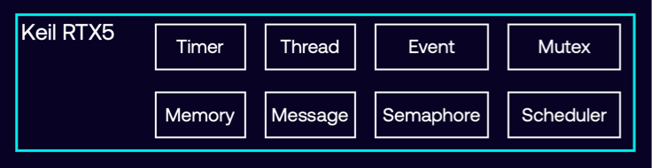

# Overview

Keil RTX version 5 (RTX5) is a real-time operating system (RTOS) for Arm Cortex-M and Cortex-A processor-based devices
that implements the [**CMSIS-RTOS2 API**](https://arm-software.github.io/CMSIS_6/latest/RTOS2/index.html) as its native
interface.

Modern microcontroller applications must often serve several concurrent activities. Keil RTX5 manages the switching
between the activities. Each activity gets a separate thread which executes a specific task and to simplify the program
structure. Keil RTX5 is scalable, and more threads can easily be added later. Threads have a priority allowing faster
execution of time-critical parts of a user application.

Keil RTX5 offers services needed in many real-time applications, such as threads, timers, memory and object management,
and message exchange. The following image shows the services of Keil RTX5.

## Features

### Open-source

- Full-featured, free-to-use commercial-grade RTOS.
- Shipped under the permissive Apache 2.0 license.
- Configurable with no restrictions.
- Publicly developed on
  [GitHub with full source code](https://github.com/ARM-software/CMSIS_5/tree/develop/CMSIS/RTOS2/RTX) available.

### Easy to use

- Reduced learning curve leading to faster product development.
- Provides configuration parameters for the kernel operation and the RTX objects.
- Configuration wizard annotations make parameter settings clear and intuitive in IDEs.

### Safe and secure

- Keil RTX5 is [PSA certified](https://www.psacertified.org/functional-api-certification/), integrating with the
  Platform Security Architecture API.
- The safety-certified variant FuSa RTX RTOS is available as part of the
  [Arm Functional Safety Run-Time System (FuSa RTS)](https://developer.arm.com/tools-and-software/embedded/fusa-run-time-system)

### Flexible scheduling

Keil RTX5 offers various
[kernel scheduling](https://arm-software.github.io/CMSIS_5/develop/RTOS2/html/theory_of_operation.html#Scheduler)
options, allowing you to choose the best scheduling for your application.

#### Pre-emptive

- Each thread has a different priority and runs until a higher priority thread is ready to run.
- Commonly used in interactive systems where a device can be in standby or background mode until some input is sent to
  it.

#### Round-robin

- Each thread runs for a fixed period of CPU run-time (time slice).
- Data loggers or system monitors typically employ round-robin scheduling to sample all sensors or data-sources in turn
  with no prioritization.

#### Co-operative

Each thread runs until it is told to pass control to another thread or reaches a blocking OS call.
Co-operative multi-tasking can be seen in applications that require a fixed order of execution.

### Fully deterministic behavior

- Known behavior for time critical tasks.
- Events and interrupts are handled within a predefined time (deadline). Applications can rely on consistent and known
  process timings.

### Low-power mode

- [Tick-less operation mode](https://arm-software.github.io/CMSIS_5/develop/RTOS2/html/theory_of_operation.html#TickLess)
  for low-power devices.

### Designed for embedded systems

- Requires minimal MCU resources with a memory footprint as small as 5 KB (ROM).
- Written for applications running on Arm Cortex-M-based MCUs.
- Quick run time.

## Links

- [Documentation](https://arm-software.github.io/CMSIS-RTX/latest/index.html)
- [Tutorial](https://arm-software.github.io/CMSIS_5/develop/RTOS2/html/rtos2_tutorial.html)
- [Examples](https://github.com/Arm-Examples/#cmsis-toolbox-examples)
- [Repository](https://github.com/ARM-software/CMSIS-RTX)
- [Issues](https://github.com/ARM-software/CMSIS-RTX/issues)
